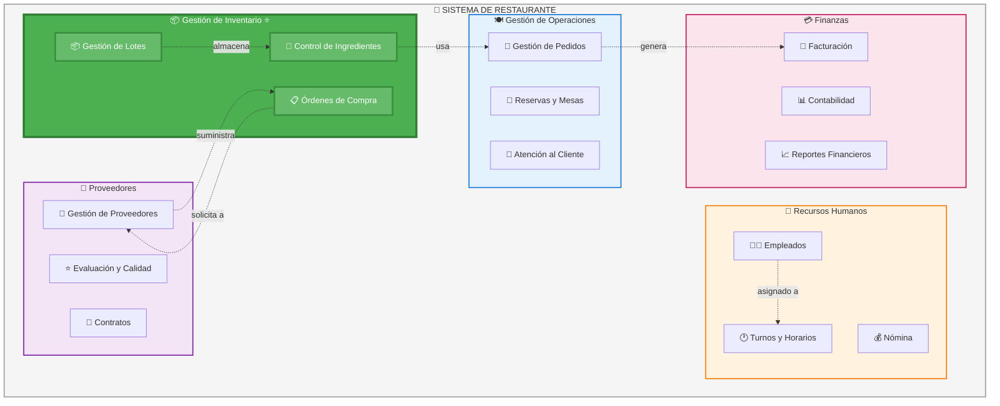
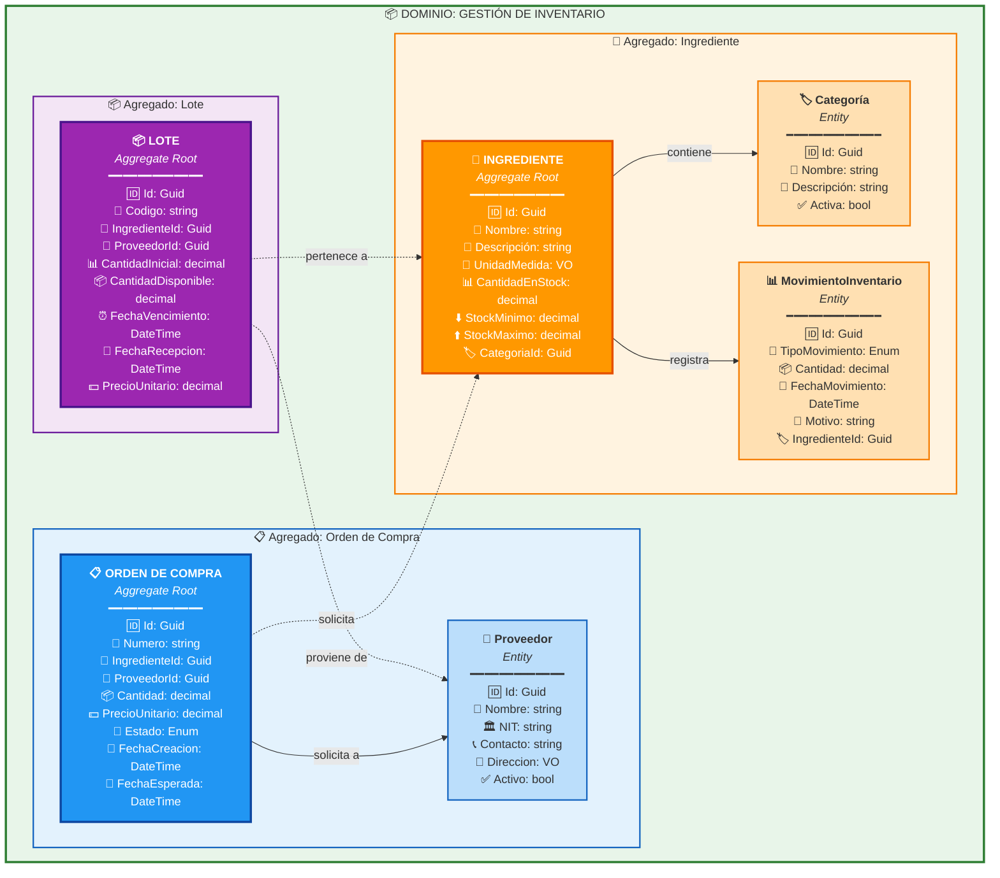
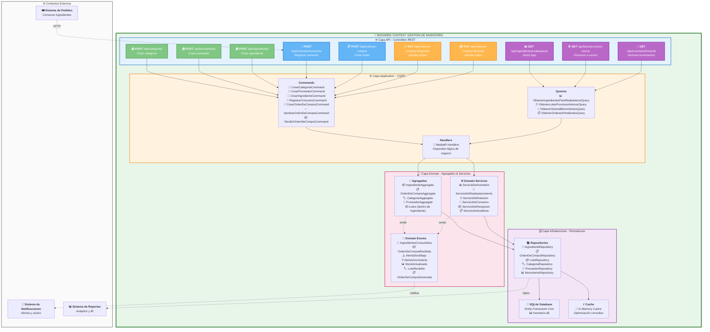
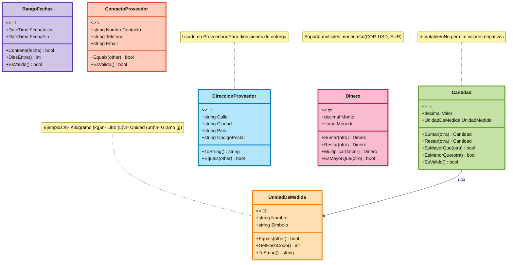
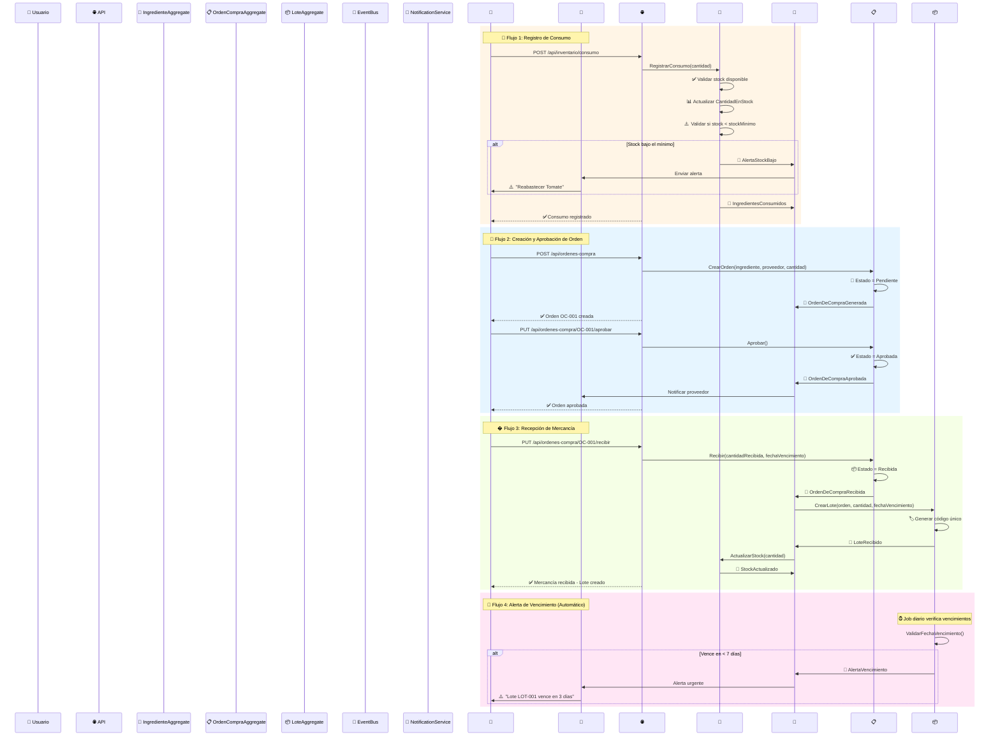

# 🍳 Sistema de Inventario de Restaurante - DDD

Sistema de gestión de inventario para restaurantes implementado con **Domain-Driven Design (DDD)**, **CQRS**, y arquitectura en capas.

---

## 📋 Tabla de Contenidos

1. [Requisitos Previos](#-requisitos-previos)
2. [Instalación](#-instalación)
3. [Cómo Ejecutar](#-cómo-ejecutar)
4. [Arquitectura DDD](#-arquitectura-ddd)
5. [Diagramas del Dominio](#-diagramas-del-dominio)
6. [Estructura del Proyecto](#-estructura-del-proyecto)
7. [Tecnologías Utilizadas](#-tecnologías-utilizadas)
8. [Documentación](#-documentación)
9. [Endpoints API](#-endpoints-api)

---

---

## 🎯 Decisiones de Diseño y Patrones

### Patrones Implementados

✅ **Agregados pequeños**: Cada agregado tiene responsabilidad única  
✅ **Inmutabilidad en Value Objects**: Garantiza consistencia  
✅ **CQRS**: Separación de comandos (escritura) y consultas (lectura)  
✅ **Domain Events**: Comunicación desacoplada entre bounded contexts  
✅ **Repository Pattern**: Abstracción de persistencia  
✅ **FEFO**: Estrategia de rotación para minimizar vencimientos  
✅ **Mediator Pattern**: Desacopla handlers con MediatR  
✅ **Dependency Injection**: IoC nativo de .NET

### Invariantes Críticas

� **Stock nunca puede ser negativo**  
🔒 **Solo órdenes aprobadas pueden ser recibidas**  
🔒 **Cantidad disponible de lote ≤ cantidad inicial**  
🔒 **Fecha de vencimiento debe ser futura al crear lote**  
🔒 **Stock mínimo < stock máximo**  
🔒 **Todo ingrediente debe tener una categoría activa**  
🔒 **Código de lote debe ser único**

### Principios DDD Aplicados

- **Ubiquitous Language**: Glosario compartido entre negocio y técnico
- **Bounded Context**: Límites claros del dominio de inventario
- **Aggregate Roots**: Ingrediente, OrdenDeCompra, Lote, Categoria, Proveedor
- **Value Objects**: UnidadDeMedida, Cantidad, DireccionProveedor, Dinero, RangoFechas
- **Domain Services**: 6 servicios que coordinan operaciones complejas
- **Domain Events**: 8+ eventos para comunicación reactiva
- **Layered Architecture**: 4 capas (API, Application, Domain, Infrastructure)

---

## 📚 Referencias y Recursos

- **Domain-Driven Design** - Eric Evans (Blue Book)
- **Implementing Domain-Driven Design** - Vaughn Vernon (Red Book)
- **Clean Architecture** - Robert C. Martin
- **CQRS Pattern** - Martin Fowler
- **Microsoft .NET Microservices Architecture**
- **Entity Framework Core Documentation**

---

## 🔧 Solución de Problemas

Antes de ejecutar el proyecto, asegúrate de tener instalado:

### Backend (.NET)
- ✅ [.NET 9.0 SDK](https://dotnet.microsoft.com/download/dotnet/9.0)
- ✅ SQLite (incluido con .NET)

### Frontend (React)
- ✅ [Node.js 18+](https://nodejs.org/) (con npm)

### Verificar Instalación

```bash
# Verificar .NET
dotnet --version
# Debería mostrar: 9.0.x

# Verificar Node.js
node --version
# Debería mostrar: v18.x o superior

# Verificar npm
npm --version
# Debería mostrar: 9.x o superior
```

---

## 📦 Instalación

### 1️⃣ Clonar el Repositorio

```bash
git clone https://github.com/daniellelooo/ddd-inventario.git
cd ddd-inventario-main
```

### 2️⃣ Instalar Dependencias del Backend

```bash
cd backend
dotnet restore
cd ..
```

### 3️⃣ Instalar Dependencias del Frontend

```bash
cd frontend
npm install
cd ..
```

---

## 🚀 Cómo Ejecutar

### Opción 1: Ejecución Automática (Recomendado) 🎯

En Windows, simplemente ejecuta el archivo batch:

```bash
start.bat
```

Esto iniciará automáticamente:
- ✅ Backend API en `http://localhost:5261`
- ✅ Frontend React en `http://localhost:3000`
- ✅ Swagger UI en `http://localhost:5261/swagger`

### Opción 2: Ejecución Manual 🔧

#### Backend (.NET API)

```bash
cd backend
dotnet run --project InventarioDDD.API
```

El backend estará disponible en:
- 🌐 API: `http://localhost:5261`
- 📚 Swagger: `http://localhost:5261/swagger`

#### Frontend (React)

En otra terminal:

```bash
cd frontend
npm start
```

El frontend se abrirá automáticamente en:
- 🌐 Frontend: `http://localhost:3000`

---

## 🏗️ Arquitectura DDD

### Dominio Seleccionado: Gestión de Inventario

**🎯 Objetivo del Dominio**: Controlar el stock de ingredientes del restaurante, gestionar órdenes de compra, rastrear lotes con fechas de vencimiento y mantener un historial de movimientos de inventario para garantizar disponibilidad continua y minimizar desperdicios.

### Casos de Uso Principales

- ✅ Registrar consumo de ingredientes
- ✅ Crear y aprobar órdenes de compra
- ✅ Recibir mercancía y crear lotes
- ✅ Alertas de stock mínimo y reabastecimiento
- ✅ Control de vencimientos (FEFO - First Expired, First Out)
- ✅ Historial de movimientos de inventario

### Arquitectura en Capas

El proyecto implementa **Domain-Driven Design (DDD)** con 4 capas:

```
┌─────────────────────────────────────────┐
│      🌐 API Layer (Controllers)         │  ← Presentación
├─────────────────────────────────────────┤
│   ⚙️ Application Layer (CQRS)           │  ← Casos de Uso
│   • Commands & Queries                  │
│   • Handlers (MediatR)                  │
│   • DTOs                                │
├─────────────────────────────────────────┤
│   🎯 Domain Layer (Lógica de Negocio)   │  ← Core
│   • Agregados (Aggregates)              │
│   • Entidades (Entities)                │
│   • Value Objects                       │
│   • Domain Events                       │
│   • Domain Services                     │
│   • Interfaces de Repositorios          │
├─────────────────────────────────────────┤
│   🗄️ Infrastructure Layer               │  ← Persistencia
│   • Repositorios (EF Core)              │
│   • Base de Datos (SQLite)              │
│   • Configuraciones                     │
└─────────────────────────────────────────┘
```

### Patrones Implementados

- ✅ **Domain-Driven Design (DDD)**
- ✅ **CQRS** (Command Query Responsibility Segregation)
- ✅ **Repository Pattern**
- ✅ **Aggregate Pattern**
- ✅ **Value Objects**
- ✅ **Domain Events**
- ✅ **Mediator Pattern** (MediatR)
- ✅ **Dependency Injection**

---

## � Diagramas del Dominio

### 1. Estructura Organizacional y Dominios



**Dominios Identificados**:
1. 🍽️ **Gestión de Operaciones** - Core Domain para servicio al cliente
2. 📦 **Gestión de Inventario** - **DOMINIO SELECCIONADO** (Supporting Domain crítico)
3. 👥 **Recursos Humanos** - Supporting Domain
4. 💳 **Finanzas** - Generic Domain
5. 🤝 **Proveedores** - Supporting Domain

---

### 2. Entidades y Agregados



**Agregados Identificados**:

#### 🧱 Agregado: Ingrediente (Root)
- **Invariantes**: Stock nunca negativo, stock máximo > mínimo, categoría activa requerida
- **Entidades**: Categoría, MovimientoInventario

#### 📋 Agregado: Orden de Compra (Root)
- **Invariantes**: Solo "Pendiente" puede aprobarse, solo "Aprobada" puede recibirse
- **Entidades**: Proveedor

#### 📦 Agregado: Lote (Root)
- **Invariantes**: Cantidad disponible ≤ inicial, fecha vencimiento futura, código único

---

### 3. Bounded Context y Arquitectura



**Flujo de Interacciones**:
1. **API REST Controllers** → Recibe requests HTTP
2. **Commands & Queries** → Encapsula intención del usuario (CQRS)
3. **Handlers (MediatR)** → Orquesta lógica de aplicación
4. **Agregados** → Aplica reglas de negocio
5. **Domain Services** → Coordina operaciones complejas
6. **Repositorios** → Persiste en SQLite con EF Core
7. **Domain Events** → Notifica cambios importantes
8. **Event Handlers** → Reacciona a eventos

---

### 4. Value Objects



**Características de Value Objects**:
- ✅ Inmutables - No cambian después de crearse
- ✅ Igualdad por valor - Dos VOs con mismos valores son iguales
- ✅ Sin identidad - No tienen ID propio
- ✅ Autovalidación - Validan sus propias reglas

---

### 5. Domain Events y Flujos



**Domain Events Implementados**:

| Evento | Trigger | Suscriptores |
|--------|---------|--------------|
| 📝 **IngredientesConsumidos** | Al registrar consumo | MovimientoInventarioService, ReportesService |
| ⚠️ **AlertaStockBajo** | Stock < stock mínimo | NotificacionesService, SugerenciasCompraService |
| 📋 **OrdenDeCompraGenerada** | Al crear orden | AuditoriaService |
| ✅ **OrdenDeCompraAprobada** | Al aprobar orden | EmailService, WorkflowService |
| 📦 **OrdenDeCompraRecibida** | Al recibir mercancía | LoteService, InventarioService, FinanzasService |
| 🏷️ **LoteRecibido** | Al crear lote | VencimientoService, TrazabilidadService |
| ⏰ **AlertaVencimiento** | Lote próximo a vencer | NotificacionesService, SugerenciasMenuService |
| 📊 **StockActualizado** | Cambio en stock | DashboardService, CacheService |

---

### 6. Domain Services

```mermaid
classDiagram
    class ServicioDeInventario {
        <<Domain Service>> 📊
        +CalcularStockTotal(ingredienteId) decimal
        +IdentificarIngredientesParaReabastecer() List~Ingrediente~
        +CalcularValorTotalInventario() Dinero
        +ObtenerDisponibilidadPorLotes(ingredienteId) List~Lote~
        +ValidarDisponibilidad(ingredienteId, cantidad) bool
    }

    class ServicioDeReabastecimiento {
        <<Domain Service>> 🔄
        +CalcularPuntoReorden(ingredienteId) decimal
        +SugerirCantidadCompra(ingredienteId) decimal
        +GenerarOrdenesAutomaticas() Task
        +CalcularConsumoPromedio(ingredienteId, dias) decimal
        +PredecirNecesidades(ingredienteId, diasFuturos) decimal
    }

    class ServicioDeRotacion {
        <<Domain Service>> ⏰
        +ObtenerLotesProximosAVencer(dias) List~Lote~
        +ValidarRotacionFEFO(ingredienteId) bool
        +CalcularMermasPorVencimiento(periodo) decimal
        +PriorizarLotesParaConsumo(ingredienteId) Lote
        +GenerarAlertasVencimiento() Task
    }

    class ServicioDeConsumo {
        <<Domain Service>> 📝
        +RegistrarConsumo(ingredienteId, cantidad, motivo) Task
        +ValidarDisponibilidadParaConsumo(ingredienteId, cantidad) bool
        +AplicarFEFO(ingredienteId, cantidad) List~Lote~
        +CalcularCostoConsumo(ingredienteId, cantidad) Dinero
    }

    class ServicioDeRecepcion {
        <<Domain Service>> 📦
        +RecibirMercancia(ordenId, cantidadRecibida) Task
        +CrearLote(orden, cantidad, fechaVencimiento) Lote
        +GenerarCodigoLote() string
        +ValidarCalidadMercancia(ordenId) bool
        +ActualizarInventario(ingredienteId, cantidad) Task
    }

    class ServicioDeAuditoria {
        <<Domain Service>> 📋
        +RegistrarMovimiento(tipo, ingredienteId, cantidad) Task
        +ObtenerHistorial(filtros) List~Movimiento~
        +GenerarReporteMovimientos(periodo) Reporte
        +RastrearTrazabilidad(loteId) Trazabilidad
    }

    ServicioDeInventario --> IngredienteRepository
    ServicioDeInventario --> LoteRepository
    ServicioDeReabastecimiento --> IngredienteRepository
    ServicioDeReabastecimiento --> MovimientoRepository
    ServicioDeRotacion --> LoteRepository
    ServicioDeConsumo --> IngredienteRepository
    ServicioDeConsumo --> LoteRepository
    ServicioDeRecepcion --> OrdenDeCompraRepository
    ServicioDeRecepcion --> LoteRepository
    ServicioDeAuditoria --> MovimientoRepository

    style ServicioDeInventario fill:#81C784,stroke:#388E3C,stroke-width:3px,color:#fff
    style ServicioDeReabastecimiento fill:#64B5F6,stroke:#1976D2,stroke-width:3px,color:#fff
    style ServicioDeRotacion fill:#FFB74D,stroke:#F57C00,stroke-width:3px,color:#fff
    style ServicioDeConsumo fill:#BA68C8,stroke:#7B1FA2,stroke-width:3px,color:#fff
    style ServicioDeRecepcion fill:#4FC3F7,stroke:#0288D1,stroke-width:3px,color:#fff
    style ServicioDeAuditoria fill:#FFD54F,stroke:#F9A825,stroke-width:3px,color:#fff
```



**Domain Services - Responsabilidades**:

1. **📊 ServicioDeInventario**: Operaciones de inventario que involucran múltiples agregados
2. **🔄 ServicioDeReabastecimiento**: Lógica de reabastecimiento inteligente
3. **⏰ ServicioDeRotacion**: Gestión de vencimientos y rotación FEFO
4. **📝 ServicioDeConsumo**: Registro y validación de consumos
5. **📦 ServicioDeRecepcion**: Recepción de mercancía y creación de lotes
6. **📋 ServicioDeAuditoria**: Trazabilidad y auditoría de movimientos

---

### 7. Lenguaje Ubicuo (Ubiquitous Language)

**📖 Glosario de Términos del Dominio**

| Término | Definición | Sinónimos |
|---------|------------|-----------|
| **🥗 Ingrediente** | Materia prima o insumo utilizado en la preparación de platos del restaurante | Insumo, Producto, Material |
| **📦 Lote** | Conjunto de unidades de un ingrediente recibidas en una misma fecha con el mismo proveedor y fecha de vencimiento | Batch, Remesa |
| **📊 Stock** | Cantidad disponible de un ingrediente en el inventario | Existencias, Disponibilidad |
| **⬇️ Stock Mínimo** | Cantidad mínima que debe mantenerse de un ingrediente para evitar desabastecimiento | Nivel de Reorden, Punto de Pedido |
| **⬆️ Stock Máximo** | Cantidad máxima que se puede almacenar de un ingrediente | Capacidad Máxima |
| **📋 Orden de Compra** | Documento que solicita la compra de ingredientes a un proveedor | OC, Purchase Order |
| **📊 Movimiento de Inventario** | Registro de entrada o salida de ingredientes del almacén | Transacción, Operación |
| **📝 Consumo** | Uso de ingredientes para preparar platos (salida de inventario) | Uso, Utilización |
| **📦 Recepción** | Entrada de mercancía al inventario proveniente de un proveedor | Ingreso, Entrada |
| **⏰ FEFO** | First Expired, First Out - Método de rotación que prioriza el uso de lotes próximos a vencer | Primero en Vencer, Primero en Salir |
| **❌ Merma** | Pérdida de ingredientes por deterioro, vencimiento o daño | Desperdicio, Loss |
| **🔄 Reabastecer** | Acción de solicitar más stock de un ingrediente cuando alcanza el nivel mínimo | Reorden, Reponer |
| **🏢 Proveedor** | Empresa o persona que suministra ingredientes al restaurante | Supplier, Vendor |
| **📏 Unidad de Medida** | Forma en que se cuantifica un ingrediente (kg, litros, unidades, etc.) | UM, UoM |
| **🏷️ Categoría** | Clasificación de ingredientes (carnes, vegetales, lácteos, etc.) | Tipo, Clase |
| **⏰ Vencimiento** | Fecha límite en que un lote puede ser utilizado de forma segura | Caducidad, Fecha de Expiración |
| **✅ Aprobar Orden** | Autorización para proceder con una orden de compra | Autorizar, Validar |
| **🚦 Estado de Orden** | Situación actual de una orden de compra (Pendiente, Aprobada, Recibida, Cancelada) | Status |

**🗣️ Frases del Lenguaje Ubicuo en Uso**:

- _"Necesitamos **reabastecer** el tomate porque está por debajo del **stock mínimo**"_
- _"El **lote** de pollo venció ayer, hay que registrar una **merma**"_
- _"Aprobé la **orden de compra** #OC-001 del **proveedor** Carnes del Valle"_
- _"Registra el **consumo** de 5 kg de papa para el plato del día"_
- _"Aplicamos **FEFO** para usar primero los lotes próximos a **vencer**"_
- _"Recibimos el **lote** LOT-2024-001 con 50 unidades de la **orden de compra** #OC-002"_

---

## �📁 Estructura del Proyecto

```
ddd-inventario-main/
├── backend/                              # Backend .NET 9
│   ├── InventarioDDD.API/               # Capa de Presentación
│   │   ├── Controllers/                 # API Controllers
│   │   │   ├── CategoriasController.cs
│   │   │   ├── ProveedoresController.cs
│   │   │   ├── IngredientesController.cs
│   │   │   ├── InventarioController.cs
│   │   │   └── OrdenesCompraController.cs
│   │   ├── Middleware/                  # Middleware personalizado
│   │   └── Program.cs                   # Entry point
│   │
│   ├── InventarioDDD.Application/       # Capa de Aplicación
│   │   ├── Commands/                    # Write operations (CQRS)
│   │   ├── Queries/                     # Read operations (CQRS)
│   │   ├── Handlers/                    # Command/Query handlers
│   │   └── DTOs/                        # Data Transfer Objects
│   │
│   ├── InventarioDDD.Domain/            # Capa de Dominio (Core)
│   │   ├── Aggregates/                  # Aggregate Roots
│   │   │   ├── IngredienteAggregate.cs
│   │   │   ├── OrdenDeCompraAggregate.cs
│   │   │   ├── CategoriaAggregate.cs
│   │   │   └── ProveedorAggregate.cs
│   │   ├── Entities/                    # Entidades del dominio
│   │   ├── ValueObjects/                # Value Objects
│   │   │   ├── UnidadDeMedida.cs
│   │   │   ├── PrecioConMoneda.cs
│   │   │   ├── DireccionProveedor.cs
│   │   │   └── FechaVencimiento.cs
│   │   ├── Events/                      # Domain Events
│   │   │   ├── InventarioEvents.cs
│   │   │   └── ComprasEvents.cs
│   │   ├── Services/                    # Domain Services
│   │   │   ├── ServicioDeInventario.cs
│   │   │   ├── ServicioDeReabastecimiento.cs
│   │   │   ├── ServicioDeRotacion.cs
│   │   │   ├── ServicioDeConsumo.cs
│   │   │   └── ServicioDeRecepcion.cs
│   │   ├── Enums/                       # Enumeraciones
│   │   └── Interfaces/                  # Interfaces de repositorios
│   │
│   └── InventarioDDD.Infrastructure/    # Capa de Infraestructura
│       ├── Persistence/                 # Entity Framework Core
│       │   └── ApplicationDbContext.cs
│       ├── Repositories/                # Implementación de repositorios
│       ├── Configuration/               # Configuraciones EF
│       └── Cache/                       # Caché en memoria
│
├── frontend/                             # Frontend React + TypeScript
│   ├── src/
│   │   ├── components/                  # Componentes reutilizables
│   │   ├── pages/                       # Páginas de la aplicación
│   │   ├── services/                    # Servicios API
│   │   ├── types.ts                     # TypeScript types
│   │   ├── App.tsx                      # Componente principal
│   │   └── index.tsx                    # Entry point
│   ├── public/
│   └── package.json
│
├── docs/                                 # Documentación
│   ├── README.md                        # Documentación DDD completa
│   ├── ESTRUCTURA_CARPETAS_DDD.md       # Guía de carpetas
│   └── COMPARACION_DIAGRAMAS_VS_IMPLEMENTACION.md
│
├── start.bat                            # Script de inicio (Windows)
└── README.md                            # Este archivo
```

---

## 🛠️ Tecnologías Utilizadas

### Backend

| Tecnología | Versión | Uso |
|------------|---------|-----|
| .NET | 9.0 | Framework principal |
| ASP.NET Core | 9.0 | Web API |
| Entity Framework Core | 9.0.9 | ORM |
| SQLite | - | Base de datos |
| MediatR | Latest | Patrón Mediator (CQRS) |
| Swashbuckle | Latest | Swagger/OpenAPI |

### Frontend

| Tecnología | Versión | Uso |
|------------|---------|-----|
| React | 18.2 | UI Framework |
| TypeScript | 4.9 | Lenguaje tipado |
| React Router | 6.26 | Enrutamiento |
| Axios | Latest | Cliente HTTP |

---

## 📚 Documentación

### Documentación Disponible

- 📖 **[Documentación DDD Completa](docs/README.md)** - Arquitectura, diagramas, bounded contexts
- 📁 **[Estructura de Carpetas](docs/ESTRUCTURA_CARPETAS_DDD.md)** - Guía de la estructura DDD
- 🔍 **[Comparación Diagramas vs Código](docs/COMPARACION_DIAGRAMAS_VS_IMPLEMENTACION.md)**

### Swagger UI

Una vez iniciado el backend, puedes explorar la API en:

🌐 **http://localhost:5261/swagger**

---

## 📝 Flujo de Uso Recomendado

Para probar el sistema completo, sigue este orden:

```bash
# 1️⃣ Crear una categoría
POST http://localhost:5261/api/categorias
Content-Type: application/json

{
  "nombre": "Vegetales",
  "descripcion": "Verduras frescas"
}

# 2️⃣ Crear un proveedor
POST http://localhost:5261/api/proveedores
Content-Type: application/json

{
  "nombre": "Verduras del Valle",
  "nit": "900123456",
  "contacto": "Juan Pérez",
  "direccion": "Calle 123, Cali"
}

# 3️⃣ Crear un ingrediente
POST http://localhost:5261/api/ingredientes
Content-Type: application/json

{
  "nombre": "Tomate",
  "descripcion": "Tomate fresco",
  "unidadMedida": "kg",
  "categoriaId": "[GUID de categoría]",
  "stockMinimo": 10,
  "stockMaximo": 100
}

# 4️⃣ Crear orden de compra
POST http://localhost:5261/api/ordenes-compra
Content-Type: application/json

{
  "ingredienteId": "[GUID]",
  "proveedorId": "[GUID]",
  "cantidad": 50,
  "precioUnitario": 2500,
  "fechaEsperada": "2025-11-15"
}

# 5️⃣ Aprobar orden
PUT http://localhost:5261/api/ordenes-compra/[ID]/aprobar

# 6️⃣ Recibir orden (crea lote automáticamente)
PUT http://localhost:5261/api/ordenes-compra/[ID]/recibir
Content-Type: application/json

{
  "cantidadRecibida": 50,
  "fechaVencimiento": "2025-11-01"
}

# 7️⃣ Registrar consumo
POST http://localhost:5261/api/inventario/consumo
Content-Type: application/json

{
  "ingredienteId": "[GUID]",
  "cantidad": 5,
  "motivo": "Plato del día"
}

# 8️⃣ Ver historial de movimientos
GET http://localhost:5261/api/inventario/historial

# 9️⃣ Ver ingredientes para reabastecer
GET http://localhost:5261/api/ingredientes/reabastecer

# 🔟 Ver lotes próximos a vencer
GET http://localhost:5261/api/lotes/proximos-vencer?dias=7
```

---

## 🌐 Endpoints API

### Categorías

```http
GET    /api/categorias           # Listar todas las categorías
POST   /api/categorias           # Crear nueva categoría
GET    /api/categorias/{id}      # Obtener categoría por ID
```

### Proveedores

```http
GET    /api/proveedores          # Listar todos los proveedores
POST   /api/proveedores          # Crear nuevo proveedor
GET    /api/proveedores/{id}     # Obtener proveedor por ID
```

### Ingredientes

```http
GET    /api/ingredientes                  # Listar todos los ingredientes
POST   /api/ingredientes                  # Crear nuevo ingrediente
GET    /api/ingredientes/{id}             # Obtener ingrediente por ID
GET    /api/ingredientes/reabastecer      # Ingredientes con stock bajo
```

### Inventario

```http
POST   /api/inventario/consumo            # Registrar consumo de ingredientes
GET    /api/inventario/historial          # Obtener historial de movimientos
```

### Órdenes de Compra

```http
GET    /api/ordenes-compra                # Listar todas las órdenes
POST   /api/ordenes-compra                # Crear nueva orden
GET    /api/ordenes-compra/{id}           # Obtener orden por ID
PUT    /api/ordenes-compra/{id}/aprobar   # Aprobar orden
PUT    /api/ordenes-compra/{id}/recibir   # Recibir orden
GET    /api/ordenes-compra/pendientes     # Órdenes pendientes
```

### Lotes

```http
GET    /api/lotes/proximos-vencer         # Lotes próximos a vencer
```

---

## 🎯 Casos de Uso Principales

1. ✅ **Registrar consumo de ingredientes** - FEFO automático
2. ✅ **Crear y aprobar órdenes de compra**
3. ✅ **Recibir mercancía y crear lotes**
4. ✅ **Alertas de stock mínimo y reabastecimiento**
5. ✅ **Control de vencimientos** (FEFO - First Expired, First Out)
6. ✅ **Historial de movimientos de inventario**
7. ✅ **Análisis de rotación de inventario**
8. ✅ **Proyección de demanda**

---

## 🗃️ Base de Datos

El proyecto utiliza **SQLite** con Entity Framework Core.

### Ubicación de la Base de Datos

```
backend/InventarioDDD.API/Inventario.db
```

### Esquema Inicial

La base de datos se crea automáticamente al iniciar la aplicación por primera vez con el esquema completo:

- ✅ Categorias
- ✅ Proveedores
- ✅ Ingredientes
- ✅ Lotes
- ✅ OrdenesDeCompra
- ✅ MovimientosInventario

**Nota**: La base de datos inicia **vacía**. Los usuarios deben crear sus propios datos desde el frontend.

### Recrear la Base de Datos

Si necesitas recrear la base de datos:

```bash
cd backend/InventarioDDD.API
Remove-Item Inventario.db* -Force
dotnet run
```

---

## 🔄 Flujo de Trabajo Recomendado

### Primera Ejecución

1. **Crear Categorías** (ej: Carnes, Vegetales, Lácteos)
2. **Crear Proveedores** (ej: Carnes del Valle, Verduras Frescas)
3. **Crear Ingredientes** (ej: Tomate, Pollo, Leche)
4. **Crear Orden de Compra** para ingredientes
5. **Aprobar Orden** de compra
6. **Recibir Orden** (esto crea lotes automáticamente y actualiza stock)
7. **Registrar Consumo** de ingredientes para preparar platos

---

## 🐛 Solución de Problemas

### El backend no inicia

```bash
# Verificar que no haya otro proceso usando el puerto 5261
netstat -ano | findstr :5261

# Si hay un proceso, detenerlo
taskkill /PID <PID> /F

# Limpiar y reconstruir
cd backend
dotnet clean
dotnet build
dotnet run --project InventarioDDD.API
```

### El frontend no inicia

```bash
# Limpiar node_modules y reinstalar
cd frontend
Remove-Item node_modules -Recurse -Force
Remove-Item package-lock.json -Force
npm install
npm start
```

### Error de conexión entre frontend y backend

1. Verificar que el backend esté ejecutándose en `http://localhost:5261`
2. Verificar la configuración de CORS en `Program.cs`
3. Verificar la URL del API en el frontend (`src/services/api.ts`)

---

## 👥 Contribuir

1. Fork el proyecto
2. Crea una rama para tu feature (`git checkout -b feature/AmazingFeature`)
3. Commit tus cambios (`git commit -m 'Add some AmazingFeature'`)
4. Push a la rama (`git push origin feature/AmazingFeature`)
5. Abre un Pull Request

---

## 📄 Licencia

Este proyecto es de uso educativo y está disponible bajo licencia MIT.

---

## 📞 Contacto

- **Repositorio**: [github.com/daniellelooo/ddd-inventario](https://github.com/daniellelooo/ddd-inventario)
- **Autor**: Daniel León

---

## ⭐ Características Destacadas

- 🏗️ Arquitectura **Domain-Driven Design (DDD)** completa
- 🔄 **CQRS** con MediatR
- 📦 **Agregados** y **Value Objects** correctamente implementados
- 🎯 **Domain Events** para comunicación desacoplada
- 📊 **Domain Services** para lógica compleja
- 🗄️ **Repository Pattern** con Entity Framework Core
- 🌐 **API RESTful** con Swagger/OpenAPI
- ⚛️ **Frontend React + TypeScript**
- 🚀 **Startup automático** con `start.bat`
- 📚 **Documentación completa** con diagramas

---

## 📊 Información del Proyecto

| Aspecto | Detalle |
|---------|---------|
| **🏢 Bounded Context** | Gestión de Inventario |
| **📅 Fecha de Creación** | Octubre 2025 |
| **📦 Versión del Sistema** | 1.0.0 |
| **👨‍💻 Framework Backend** | .NET 9.0 |
| **🗄️ Base de Datos** | SQLite |
| **🎨 Framework Frontend** | React 18.2 + TypeScript 4.9 |
| **🏗️ Patrón Arquitectónico** | Domain-Driven Design (4 capas) |
| **📐 Patrón de Diseño** | CQRS, Repository, Aggregate, Domain Events |

### 📚 Referencias Académicas

- **Domain-Driven Design** - Eric Evans (Blue Book)
- **Implementing Domain-Driven Design** - Vaughn Vernon (Red Book)
- **Clean Architecture** - Robert C. Martin
- **CQRS Pattern** - Martin Fowler
- **Microsoft .NET Microservices Architecture**

### 🔒 Invariantes Críticas Implementadas

✅ Stock nunca puede ser negativo  
✅ Solo órdenes aprobadas pueden ser recibidas  
✅ Cantidad disponible de lote ≤ cantidad inicial  
✅ Fecha de vencimiento debe ser futura al crear lote  
✅ Stock mínimo < stock máximo  
✅ Todo ingrediente debe tener una categoría activa  
✅ Código de lote debe ser único

### 🎯 Principios DDD Aplicados

- **Ubiquitous Language**: Glosario compartido entre negocio y técnico (ver [lenguaje ubicuo](#7-lenguaje-ubicuo-ubiquitous-language))
- **Bounded Context**: Límites claros del dominio de inventario
- **Aggregate Roots**: Ingrediente, OrdenDeCompra, Lote, Categoria, Proveedor
- **Value Objects**: UnidadDeMedida, Cantidad, DireccionProveedor, Dinero, RangoFechas
- **Domain Services**: 6 servicios que coordinan operaciones complejas
- **Domain Events**: 8+ eventos para comunicación reactiva
- **Layered Architecture**: 4 capas (API, Application, Domain, Infrastructure)

---

**¡Listo para usar! 🎉**

Ejecuta `start.bat` y comienza a gestionar tu inventario de restaurante.

**⭐ Si este proyecto te fue útil, no olvides darle una estrella en GitHub!**
