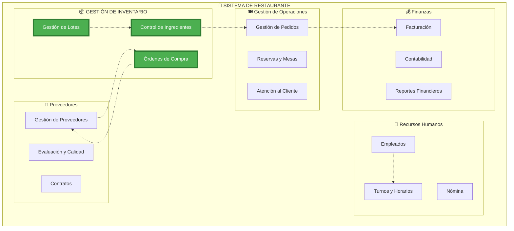
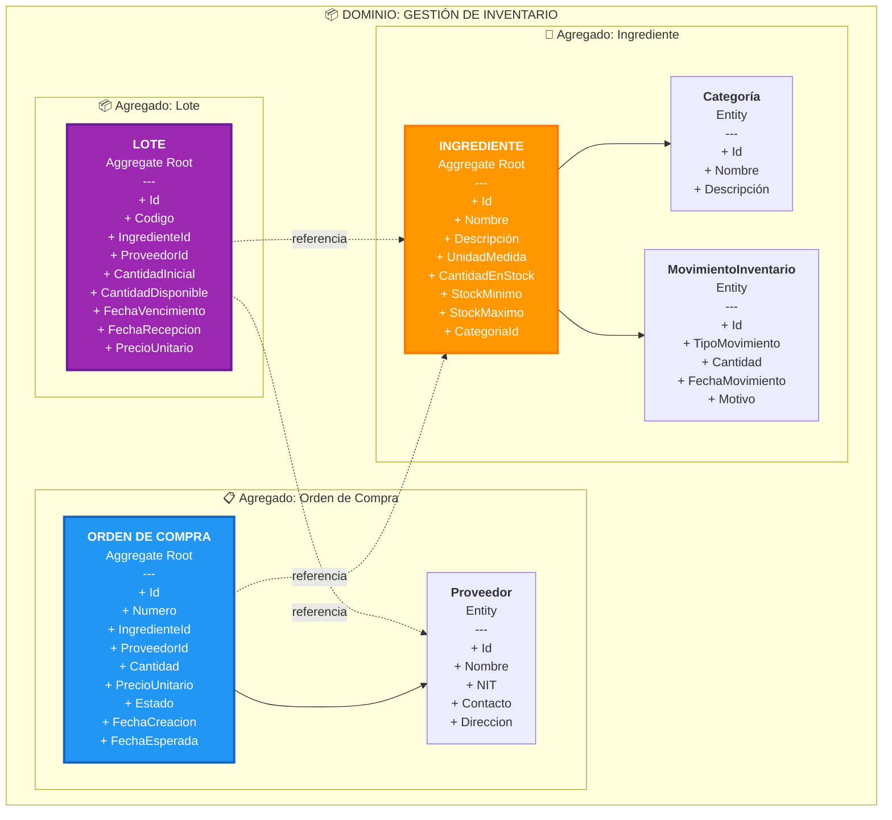
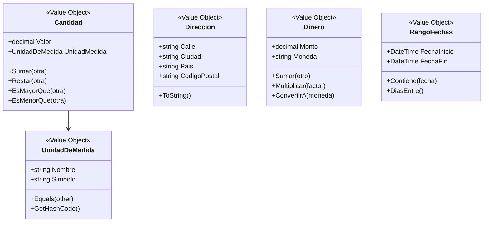
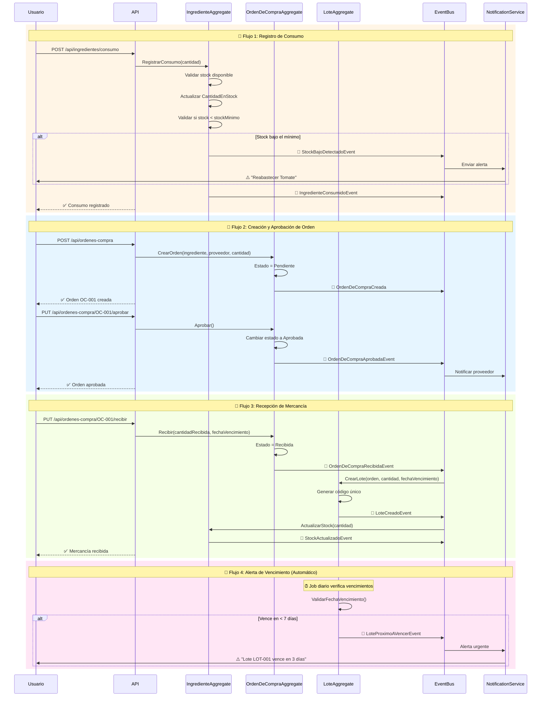

# 📚 Documentación DDD - Sistema de Inventario de Restaurante

## 📋 Tabla de Contenidos

1. [Estructura Organizacional y Dominios](#1-estructura-organizacional-y-dominios)
2. [Dominio Seleccionado: Gestión de Inventario](#2-dominio-seleccionado-gestión-de-inventario)
3. [Entidades y Agregados](#3-entidades-y-agregados)
4. [Bounded Context](#4-bounded-context)
5. [Lenguaje Ubicuo - Glosario](#5-lenguaje-ubicuo---glosario)
6. [Objetos de Valor](#6-objetos-de-valor)
7. [Triggers y Eventos del Dominio](#7-triggers-y-eventos-del-dominio)
8. [Servicios del Dominio](#8-servicios-del-dominio)

---

## 1. Estructura Organizacional y Dominios



### Dominios Identificados por Afinidad:

1. **🍽️ Gestión de Operaciones** - Core Domain para servicio al cliente
2. **📦 Gestión de Inventario** - **DOMINIO SELECCIONADO** (Supporting Domain crítico)
3. **👥 Recursos Humanos** - Supporting Domain
4. **💰 Finanzas** - Generic Domain
5. **🤝 Proveedores** - Supporting Domain

---

## 2. Dominio Seleccionado: Gestión de Inventario

### 🎯 Objetivo del Dominio

Controlar el stock de ingredientes del restaurante, gestionar órdenes de compra, rastrear lotes con fechas de vencimiento y mantener un historial de movimientos de inventario para garantizar disponibilidad continua y minimizar desperdicios.

### 🔑 Casos de Uso Principales

- ✅ Registrar consumo de ingredientes
- ✅ Crear y aprobar órdenes de compra
- ✅ Recibir mercancía y crear lotes
- ✅ Alertas de stock mínimo y reabastecimiento
- ✅ Control de vencimientos (FEFO - First Expired, First Out)
- ✅ Historial de movimientos de inventario

---

## 3. Entidades y Agregados



### Agregados Identificados:

#### 🧱 **Agregado: Ingrediente** (Aggregate Root)

- **Root Entity**: `Ingrediente`
- **Child Entities**: `Categoría`, `MovimientoInventario`
- **Invariantes**:
  - Stock nunca puede ser negativo
  - Stock máximo debe ser mayor que stock mínimo
  - Todo ingrediente debe tener una categoría activa

#### 📋 **Agregado: Orden de Compra** (Aggregate Root)

- **Root Entity**: `OrdenDeCompra`
- **Child Entities**: `Proveedor`
- **Invariantes**:
  - Solo órdenes en estado "Pendiente" pueden ser aprobadas
  - Solo órdenes "Aprobadas" pueden ser recibidas
  - La cantidad debe ser mayor que cero

#### 📦 **Agregado: Lote** (Aggregate Root)

- **Root Entity**: `Lote`
- **Invariantes**:
  - Cantidad disponible no puede exceder cantidad inicial
  - Fecha de vencimiento debe ser futura al momento de recepción
  - Código de lote debe ser único

---

## 4. Bounded Context

```mermaid
graph TB
    subgraph "🔷 BOUNDED CONTEXT: GESTIÓN DE INVENTARIO"
        style BC fill:#4CAF50,stroke:#2E7D32,stroke-width:4px,color:#fff

        subgraph "📊 Capa de Aplicación - APIs REST"
            API1[<b>POST</b> /api/ingredientes/consumo<br/><i>Registrar consumo</i>]
            API2[<b>POST</b> /api/ordenes-compra<br/><i>Crear orden</i>]
            API3[<b>PUT</b> /api/ordenes-compra/:id/aprobar<br/><i>Aprobar orden</i>]
            API4[<b>PUT</b> /api/ordenes-compra/:id/recibir<br/><i>Recibir orden</i>]
            API5[<b>GET</b> /api/ingredientes/reabastecer<br/><i>Ingredientes con stock bajo</i>]
            API6[<b>GET</b> /api/lotes/proximos-vencer<br/><i>Lotes próximos a vencer</i>]
            API7[<b>GET</b> /api/inventario/historial<br/><i>Movimientos de inventario</i>]
        end

        subgraph "⚙️ Capa de Dominio - Agregados"
            AGG1[<b>IngredienteAggregate</b><br/>+ RegistrarConsumo<br/>+ ActualizarStock<br/>+ ValidarStockMinimo]
            AGG2[<b>OrdenDeCompraAggregate</b><br/>+ Crear<br/>+ Aprobar<br/>+ Recibir<br/>+ Validar]
            AGG3[<b>LoteAggregate</b><br/>+ Crear<br/>+ ConsumirCantidad<br/>+ ValidarVencimiento]
        end

        subgraph "🎯 Servicios de Dominio"
            SVC1[<b>InventarioService</b><br/>+ CalcularStockTotal<br/>+ IdentificarReabastecimiento]
            SVC2[<b>OrdenDeCompraService</b><br/>+ GenerarNumeroOrden<br/>+ ValidarProveedor]
            SVC3[<b>VencimientoService</b><br/>+ ObtenerLotesProximos<br/>+ AlertasVencimiento]
        end

        subgraph "🗄️ Capa de Infraestructura"
            REPO1[(IngredienteRepository)]
            REPO2[(OrdenDeCompraRepository)]
            REPO3[(LoteRepository)]
            REPO4[(MovimientoRepository)]
            DB[(SQLite Database)]
        end

        subgraph "🔔 Eventos de Dominio"
            EVT1[IngredienteConsumidoEvent]
            EVT2[OrdenDeCompraAprobadaEvent]
            EVT3[OrdenDeCompraRecibidaEvent]
            EVT4[StockBajoDetectadoEvent]
            EVT5[LoteProximoAVencerEvent]
        end
    end

    subgraph "🌐 Contextos Externos"
        EXT1[Sistema de Pedidos<br/><i>consume ingredientes</i>]
        EXT2[Sistema de Proveedores<br/><i>gestiona proveedores</i>]
        EXT3[Sistema de Notificaciones<br/><i>alertas</i>]
    end

    API1 --> AGG1
    API2 --> AGG2
    API3 --> AGG2
    API4 --> AGG2
    API5 --> SVC1
    API6 --> SVC3
    API7 --> REPO4

    AGG1 --> SVC1
    AGG2 --> SVC2
    AGG3 --> SVC3

    AGG1 --> REPO1
    AGG2 --> REPO2
    AGG3 --> REPO3

    REPO1 --> DB
    REPO2 --> DB
    REPO3 --> DB
    REPO4 --> DB

    AGG1 -.->|emite| EVT1
    AGG2 -.->|emite| EVT2
    AGG2 -.->|emite| EVT3
    SVC1 -.->|emite| EVT4
    SVC3 -.->|emite| EVT5

    EXT1 -.->|API Call| API1
    EVT2 -.->|notifica| EXT2
    EVT4 -.->|notifica| EXT3
    EVT5 -.->|notifica| EXT3

    style API1 fill:#42A5F5
    style API2 fill:#42A5F5
    style API3 fill:#42A5F5
    style API4 fill:#42A5F5
    style API5 fill:#66BB6A
    style API6 fill:#66BB6A
    style API7 fill:#66BB6A
```



### Flujo de Interacciones:

1. **API REST** → Recibe requests HTTP
2. **Handlers/Commands** → Orquesta lógica de aplicación
3. **Agregados** → Aplica reglas de negocio
4. **Servicios de Dominio** → Coordina operaciones entre agregados
5. **Repositorios** → Persiste en base de datos
6. **Eventos** → Notifica a otros bounded contexts

---

## 5. Lenguaje Ubicuo - Glosario

### 📖 Términos de Negocio del Dominio de Inventario

| Término                      | Definición                                                                                                        | Sinónimos                           |
| ---------------------------- | ----------------------------------------------------------------------------------------------------------------- | ----------------------------------- |
| **Ingrediente**              | Materia prima o insumo utilizado en la preparación de platos del restaurante                                      | Insumo, Producto, Material          |
| **Lote**                     | Conjunto de unidades de un ingrediente recibidas en una misma fecha con el mismo proveedor y fecha de vencimiento | Batch, Remesa                       |
| **Stock**                    | Cantidad disponible de un ingrediente en el inventario                                                            | Existencias, Disponibilidad         |
| **Stock Mínimo**             | Cantidad mínima que debe mantenerse de un ingrediente para evitar desabastecimiento                               | Nivel de Reorden, Punto de Pedido   |
| **Stock Máximo**             | Cantidad máxima que se puede almacenar de un ingrediente                                                          | Capacidad Máxima                    |
| **Orden de Compra**          | Documento que solicita la compra de ingredientes a un proveedor                                                   | OC, Purchase Order                  |
| **Movimiento de Inventario** | Registro de entrada o salida de ingredientes del almacén                                                          | Transacción, Operación              |
| **Consumo**                  | Uso de ingredientes para preparar platos (salida de inventario)                                                   | Uso, Utilización                    |
| **Recepción**                | Entrada de mercancía al inventario proveniente de un proveedor                                                    | Ingreso, Entrada                    |
| **FEFO**                     | First Expired, First Out - Método de rotación que prioriza el uso de lotes próximos a vencer                      | Primero en Vencer, Primero en Salir |
| **Merma**                    | Pérdida de ingredientes por deterioro, vencimiento o daño                                                         | Desperdicio, Loss                   |
| **Reabastecer**              | Acción de solicitar más stock de un ingrediente cuando alcanza el nivel mínimo                                    | Reorden, Reponer                    |
| **Proveedor**                | Empresa o persona que suministra ingredientes al restaurante                                                      | Supplier, Vendor                    |
| **Unidad de Medida**         | Forma en que se cuantifica un ingrediente (kg, litros, unidades, etc.)                                            | UM, UoM                             |
| **Categoría**                | Clasificación de ingredientes (carnes, vegetales, lácteos, etc.)                                                  | Tipo, Clase                         |
| **Vencimiento**              | Fecha límite en que un lote puede ser utilizado de forma segura                                                   | Caducidad, Fecha de Expiración      |
| **Aprobar Orden**            | Autorización para proceder con una orden de compra                                                                | Autorizar, Validar                  |
| **Estado de Orden**          | Situación actual de una orden de compra (Pendiente, Aprobada, Recibida, Cancelada)                                | Status                              |

### 🗣️ Frases del Lenguaje Ubicuo:

- "Necesitamos **reabastecer** el tomate porque está por debajo del **stock mínimo**"
- "El **lote** de pollo venció ayer, hay que registrar una **merma**"
- "Aprobé la **orden de compra** #OC-001 del **proveedor** Carnes del Valle"
- "Registra el **consumo** de 5 kg de papa para el plato del día"
- "Aplicamos **FEFO** para usar primero los lotes próximos a **vencer**"
- "Recibimos el **lote** LOT-2024-001 con 50 unidades de la **orden de compra** #OC-002"

---

## 6. Objetos de Valor

### 💎 Value Objects del Dominio



#### 🔹 **UnidadDeMedida**

```csharp
public class UnidadDeMedida : ValueObject
{
    public string Nombre { get; }
    public string Simbolo { get; }

    // Ejemplos:
    // - Kilogramo (kg)
    // - Litro (L)
    // - Unidad (un)
    // - Gramo (g)
}
```

**Características**:

- Inmutable
- Igualdad por valor (dos unidades con mismo nombre y símbolo son iguales)
- Sin identidad propia

#### 🔹 **Cantidad**

```csharp
public class Cantidad : ValueObject
{
    public decimal Valor { get; }
    public UnidadDeMedida UnidadMedida { get; }

    public Cantidad Sumar(Cantidad otra)
    public Cantidad Restar(Cantidad otra)
    public bool EsMayorQue(Cantidad otra)
}
```

**Reglas**:

- No se pueden sumar cantidades con diferentes unidades de medida
- El valor debe ser siempre >= 0
- Operaciones retornan nuevas instancias (inmutabilidad)

#### 🔹 **Direccion**

```csharp
public class Direccion : ValueObject
{
    public string Calle { get; }
    public string Ciudad { get; }
    public string Pais { get; }
    public string CodigoPostal { get; }
}
```

**Uso**: Dirección de proveedores para entregas

#### 🔹 **Dinero**

```csharp
public class Dinero : ValueObject
{
    public decimal Monto { get; }
    public string Moneda { get; } // "COP", "USD", etc.

    public Dinero Multiplicar(decimal factor)
}
```

**Uso**: Precios unitarios en órdenes de compra y lotes

#### 🔹 **RangoFechas**

```csharp
public class RangoFechas : ValueObject
{
    public DateTime FechaInicio { get; }
    public DateTime FechaFin { get; }

    public bool Contiene(DateTime fecha)
    public int DiasEntre()
}
```

**Uso**: Consultas de historial de movimientos, reportes

---

## 7. Triggers y Eventos del Dominio



### 🎯 Eventos del Dominio

#### 🔔 **1. IngredienteConsumidoEvent**

```csharp
public class IngredienteConsumidoEvent : IDomainEvent
{
    public Guid IngredienteId { get; }
    public string NombreIngrediente { get; }
    public decimal CantidadConsumida { get; }
    public UnidadDeMedida UnidadMedida { get; }
    public Guid? LoteId { get; }
    public DateTime FechaConsumo { get; }
    public string Motivo { get; }
}
```

**Trigger**: Al registrar consumo de un ingrediente  
**Suscriptores**:

- MovimientoInventarioService (registra el movimiento)
- ReportesService (actualiza estadísticas)

---

#### 🔔 **2. StockBajoDetectadoEvent**

```csharp
public class StockBajoDetectadoEvent : IDomainEvent
{
    public Guid IngredienteId { get; }
    public string NombreIngrediente { get; }
    public decimal StockActual { get; }
    public decimal StockMinimo { get; }
    public decimal CantidadRecomendadaReabastecer { get; }
    public DateTime FechaDeteccion { get; }
}
```

**Trigger**: Cuando stock < stock mínimo después de un consumo  
**Suscriptores**:

- NotificacionesService (envía alerta al gerente)
- SugerenciasCompraService (sugiere crear orden de compra)

---

#### 🔔 **3. OrdenDeCompraCreada**

```csharp
public class OrdenDeCompraCreada : IDomainEvent
{
    public Guid OrdenId { get; }
    public string NumeroOrden { get; }
    public Guid ProveedorId { get; }
    public Guid IngredienteId { get; }
    public decimal CantidadSolicitada { get; }
    public DateTime FechaCreacion { get; }
}
```

**Trigger**: Al crear una nueva orden de compra  
**Suscriptores**:

- AuditoriaService (registra la operación)

---

#### 🔔 **4. OrdenDeCompraAprobadaEvent**

```csharp
public class OrdenDeCompraAprobadaEvent : IDomainEvent
{
    public Guid OrdenId { get; }
    public string NumeroOrden { get; }
    public Guid ProveedorId { get; }
    public string NombreProveedor { get; }
    public DateTime FechaAprobacion { get; }
    public string UsuarioQueAprobo { get; }
}
```

**Trigger**: Al aprobar una orden de compra  
**Suscriptores**:

- EmailService (notifica al proveedor)
- WorkflowService (marca tarea como completada)

---

#### 🔔 **5. OrdenDeCompraRecibidaEvent**

```csharp
public class OrdenDeCompraRecibidaEvent : IDomainEvent
{
    public Guid OrdenId { get; }
    public string NumeroOrden { get; }
    public Guid IngredienteId { get; }
    public decimal CantidadRecibida { get; }
    public DateTime FechaRecepcion { get; }
    public DateTime FechaVencimiento { get; }
    public string CodigoLoteGenerado { get; }
}
```

**Trigger**: Al recibir mercancía de una orden aprobada  
**Suscriptores**:

- LoteService (crea nuevo lote)
- InventarioService (actualiza stock del ingrediente)
- FinanzasService (registra pasivo con proveedor)

---

#### 🔔 **6. LoteCreadoEvent**

```csharp
public class LoteCreadoEvent : IDomainEvent
{
    public Guid LoteId { get; }
    public string Codigo { get; }
    public Guid IngredienteId { get; }
    public decimal Cantidad { get; }
    public DateTime FechaVencimiento { get; }
    public Guid? OrdenDeCompraId { get; }
}
```

**Trigger**: Al crear un nuevo lote (recepción de mercancía)  
**Suscriptores**:

- VencimientoService (programa alerta de vencimiento)
- TrazabilidadService (registra cadena de custodia)

---

#### 🔔 **7. LoteProximoAVencerEvent**

```csharp
public class LoteProximoAVencerEvent : IDomainEvent
{
    public Guid LoteId { get; }
    public string Codigo { get; }
    public Guid IngredienteId { get; }
    public string NombreIngrediente { get; }
    public DateTime FechaVencimiento { get; }
    public int DiasHastaVencimiento { get; }
    public decimal CantidadDisponible { get; }
}
```

**Trigger**: Job automático diario que detecta lotes que vencen en < 7 días  
**Suscriptores**:

- NotificacionesService (alerta urgente al chef)
- SugerenciasMenuService (sugiere usar ese ingrediente en menú del día)

---

#### 🔔 **8. StockActualizadoEvent**

```csharp
public class StockActualizadoEvent : IDomainEvent
{
    public Guid IngredienteId { get; }
    public decimal StockAnterior { get; }
    public decimal StockNuevo { get; }
    public string TipoMovimiento { get; } // "Entrada" o "Salida"
    public DateTime FechaActualizacion { get; }
}
```

**Trigger**: Cada vez que cambia el stock de un ingrediente  
**Suscriptores**:

- DashboardService (actualiza métricas en tiempo real)
- CacheService (invalida cache de stock)

---

## 8. Servicios del Dominio

### ⚙️ Domain Services

```mermaid
classDiagram
    class InventarioService {
        <<Domain Service>>
        +CalcularStockTotal(ingredienteId)
        +IdentificarIngredientesParaReabastecer()
        +CalcularValorTotalInventario()
        +ObtenerDisponibilidadPorLotes(ingredienteId)
    }

    class OrdenDeCompraService {
        <<Domain Service>>
        +GenerarNumeroOrden()
        +ValidarProveedorActivo(proveedorId)
        +CalcularCostoTotal(orden)
        +SugerirCantidadOptima(ingredienteId)
    }

    class VencimientoService {
        <<Domain Service>>
        +ObtenerLotesProximosAVencer(dias)
        +ValidarRotacionFEFO(ingredienteId)
        +CalcularMermasPorVencimiento(periodo)
        +PriorizarLotesParaConsumo(ingredienteId)
    }

    class MovimientoInventarioService {
        <<Domain Service>>
        +RegistrarMovimiento(tipo, ingrediente, cantidad, motivo)
        +ObtenerHistorial(filtros)
        +GenerarReporteMovimientos(periodo)
    }

    class ReabastecimientoService {
        <<Domain Service>>
        +CalcularPuntoReorden(ingredienteId)
        +SugerirCantidadCompra(ingredienteId, consumoPromedio)
        +GenerarOrdenesAutomaticas()
    }

    InventarioService --> IngredienteRepository
    InventarioService --> LoteRepository
    OrdenDeCompraService --> OrdenDeCompraRepository
    OrdenDeCompraService --> ProveedorRepository
    VencimientoService --> LoteRepository
    MovimientoInventarioService --> MovimientoRepository
    ReabastecimientoService --> IngredienteRepository
```



---

### 🔧 **1. InventarioService**

**Responsabilidad**: Coordinar operaciones de inventario que involucran múltiples agregados.

```csharp
public class InventarioService
{
    public async Task<decimal> CalcularStockTotal(Guid ingredienteId)
    {
        // Suma stock de todos los lotes activos del ingrediente
        var lotes = await _loteRepository.ObtenerPorIngrediente(ingredienteId);
        return lotes.Sum(l => l.CantidadDisponible.Valor);
    }

    public async Task<List<IngredienteDto>> IdentificarIngredientesParaReabastecer()
    {
        // Encuentra ingredientes donde Stock < StockMinimo
        var ingredientes = await _ingredienteRepository.ObtenerTodos();
        return ingredientes
            .Where(i => i.CantidadEnStock.Valor < i.StockMinimo.Valor)
            .Select(i => MapToDto(i))
            .ToList();
    }

    public async Task<Dinero> CalcularValorTotalInventario()
    {
        // Calcula valor monetario de todo el inventario
        var lotes = await _loteRepository.ObtenerTodos();
        return lotes.Sum(l => l.PrecioUnitario.Multiplicar(l.CantidadDisponible.Valor));
    }
}
```

**Casos de Uso**:

- Dashboard: Mostrar valor total del inventario
- Reportes: Análisis de stock
- Alertas: Detectar ingredientes para reabastecer

---

### 🔧 **2. OrdenDeCompraService**

**Responsabilidad**: Lógica de negocio para órdenes de compra que requiere coordinación entre proveedores e ingredientes.

```csharp
public class OrdenDeCompraService
{
    public string GenerarNumeroOrden()
    {
        // Genera número único: OC-2024-0001
        var ultimaOrden = await _ordenRepository.ObtenerUltima();
        var numero = ultimaOrden?.Numero ?? "OC-2024-0000";
        return IncrementarNumero(numero);
    }

    public async Task<bool> ValidarProveedorActivo(Guid proveedorId)
    {
        var proveedor = await _proveedorRepository.ObtenerPorId(proveedorId);
        return proveedor?.Activo ?? false;
    }

    public async Task<decimal> SugerirCantidadOptima(Guid ingredienteId)
    {
        // Calcula: StockMaximo - StockActual + ConsumoPromedioDiario * 7 días
        var ingrediente = await _ingredienteRepository.ObtenerPorId(ingredienteId);
        var consumoPromedio = await CalcularConsumoPromedio(ingredienteId, diasHistorico: 30);

        var cantidadFaltante = ingrediente.StockMaximo.Valor - ingrediente.CantidadEnStock.Valor;
        var bufferSemana = consumoPromedio * 7;

        return cantidadFaltante + bufferSemana;
    }
}
```

**Casos de Uso**:

- Crear órdenes con numeración secuencial
- Validaciones antes de crear/aprobar orden
- Sugerencias inteligentes de cantidad

---

### 🔧 **3. VencimientoService**

**Responsabilidad**: Gestión de lotes próximos a vencer y aplicación de FEFO.

```csharp
public class VencimientoService
{
    public async Task<List<LoteDto>> ObtenerLotesProximosAVencer(int diasAnticipacion = 7)
    {
        var fechaLimite = DateTime.Now.AddDays(diasAnticipacion);
        var lotes = await _loteRepository.ObtenerTodos();

        return lotes
            .Where(l => l.FechaVencimiento <= fechaLimite && l.CantidadDisponible.Valor > 0)
            .OrderBy(l => l.FechaVencimiento)
            .Select(l => MapToDto(l))
            .ToList();
    }

    public async Task<Lote> PriorizarLotesParaConsumo(Guid ingredienteId)
    {
        // Implementa FEFO: retorna el lote con fecha de vencimiento más cercana
        var lotes = await _loteRepository.ObtenerPorIngrediente(ingredienteId);
        return lotes
            .Where(l => l.CantidadDisponible.Valor > 0)
            .OrderBy(l => l.FechaVencimiento)
            .FirstOrDefault();
    }

    public async Task<decimal> CalcularMermasPorVencimiento(RangoFechas periodo)
    {
        // Suma todas las mermas por vencimiento en un periodo
        var movimientos = await _movimientoRepository.ObtenerPorTipoYPeriodo(
            TipoMovimiento.Merma,
            periodo.FechaInicio,
            periodo.FechaFin
        );

        return movimientos
            .Where(m => m.Motivo.Contains("Vencimiento"))
            .Sum(m => m.Cantidad.Valor);
    }
}
```

**Casos de Uso**:

- Alertas diarias de vencimientos
- Aplicar FEFO al registrar consumos
- Reportes de mermas

---

### 🔧 **4. MovimientoInventarioService**

**Responsabilidad**: Registrar y consultar historial de movimientos.

```csharp
public class MovimientoInventarioService
{
    public async Task RegistrarMovimiento(
        TipoMovimiento tipo,
        Guid ingredienteId,
        Cantidad cantidad,
        string motivo,
        Guid? loteId = null)
    {
        var movimiento = new MovimientoInventario(
            id: Guid.NewGuid(),
            ingredienteId: ingredienteId,
            loteId: loteId,
            tipo: tipo,
            cantidad: cantidad,
            fechaMovimiento: DateTime.Now,
            motivo: motivo
        );

        await _movimientoRepository.Agregar(movimiento);
    }

    public async Task<List<MovimientoDto>> ObtenerHistorial(
        Guid? ingredienteId = null,
        TipoMovimiento? tipo = null,
        DateTime? desde = null,
        DateTime? hasta = null)
    {
        // Consulta flexible con múltiples filtros
        var query = _movimientoRepository.Query();

        if (ingredienteId.HasValue)
            query = query.Where(m => m.IngredienteId == ingredienteId.Value);

        if (tipo.HasValue)
            query = query.Where(m => m.TipoMovimiento == tipo.Value);

        if (desde.HasValue)
            query = query.Where(m => m.FechaMovimiento >= desde.Value);

        if (hasta.HasValue)
            query = query.Where(m => m.FechaMovimiento <= hasta.Value);

        return await query.ToListAsync();
    }
}
```

**Casos de Uso**:

- Auditoría de operaciones
- Reportes de consumo
- Trazabilidad de lotes

---

### 🔧 **5. ReabastecimientoService**

**Responsabilidad**: Lógica para sugerir y automatizar reabastecimientos.

```csharp
public class ReabastecimientoService
{
    public async Task<decimal> CalcularPuntoReorden(Guid ingredienteId)
    {
        // Punto de reorden = Consumo promedio diario * Días de espera del proveedor + Stock de seguridad
        var ingrediente = await _ingredienteRepository.ObtenerPorId(ingredienteId);
        var consumoPromedio = await CalcularConsumoPromedioDiario(ingredienteId);

        const int diasEsperaProveedor = 3;
        var stockSeguridad = ingrediente.StockMinimo.Valor;

        return (consumoPromedio * diasEsperaProveedor) + stockSeguridad;
    }

    public async Task<decimal> SugerirCantidadCompra(Guid ingredienteId)
    {
        // Cantidad óptima de compra (EOQ simplificado)
        var ingrediente = await _ingredienteRepository.ObtenerPorId(ingredienteId);
        var consumoMensual = await CalcularConsumoPromedio(ingredienteId, dias: 30);

        // Comprar suficiente para 15 días de operación
        return consumoMensual / 2;
    }

    public async Task GenerarOrdenesAutomaticas()
    {
        // Job que se ejecuta diariamente para crear órdenes automáticas
        var ingredientesBajos = await _inventarioService.IdentificarIngredientesParaReabastecer();

        foreach (var ingrediente in ingredientesBajos)
        {
            var proveedorPreferido = await _proveedorRepository.ObtenerPrincipalPorIngrediente(ingrediente.Id);
            var cantidadSugerida = await SugerirCantidadCompra(ingrediente.Id);

            // Crear orden automática
            var command = new CrearOrdenDeCompraCommand(
                ingredienteId: ingrediente.Id,
                proveedorId: proveedorPreferido.Id,
                cantidad: cantidadSugerida,
                fechaEsperada: DateTime.Now.AddDays(3)
            );

            await _mediator.Send(command);
        }
    }
}
```

**Casos de Uso**:

- Órdenes automáticas cuando stock < punto de reorden
- Sugerencias inteligentes de compra
- Optimización de inventario

---

## 📊 Resumen de Arquitectura

### Capas del Sistema:

1. **🌐 API Layer** (InventarioDDD.API)

   - Controllers REST
   - Middleware de excepciones
   - Swagger/OpenAPI

2. **📋 Application Layer** (InventarioDDD.Application)

   - Commands y Queries (CQRS)
   - Handlers
   - DTOs

3. **🎯 Domain Layer** (InventarioDDD.Domain)

   - Agregados
   - Entidades
   - Value Objects
   - Domain Services
   - Domain Events
   - Interfaces de Repositorios

4. **🗄️ Infrastructure Layer** (InventarioDDD.Infrastructure)
   - Repositorios (Entity Framework Core)
   - Configuraciones de EF
   - Persistencia (SQLite)
   - Cache

---

## 🚀 Tecnologías Utilizadas

- **.NET 9.0** - Framework backend
- **Entity Framework Core 9.0.9** - ORM
- **SQLite** - Base de datos
- **MediatR** - Patrón Mediator para CQRS
- **React 18.2** + **TypeScript 4.9** - Frontend
- **React Router 6.26** - Enrutamiento SPA

---

## 📝 Notas de Implementación

### Decisiones de Diseño:

✅ **Agregados pequeños**: Cada agregado tiene responsabilidad única  
✅ **Inmutabilidad en Value Objects**: Garantiza consistencia  
✅ **CQRS**: Separación de comandos y consultas  
✅ **Domain Events**: Comunicación desacoplada entre bounded contexts  
✅ **Repository Pattern**: Abstracción de persistencia  
✅ **FEFO**: Estrategia de rotación para minimizar vencimientos

### Invariantes Críticas:

🔒 Stock nunca puede ser negativo  
🔒 Solo órdenes aprobadas pueden ser recibidas  
🔒 Cantidad disponible de lote ≤ cantidad inicial  
🔒 Fecha de vencimiento debe ser futura al crear lote  
🔒 Stock mínimo < stock máximo

---

## 📖 Referencias

- **Domain-Driven Design** - Eric Evans
- **Implementing Domain-Driven Design** - Vaughn Vernon
- **Clean Architecture** - Robert C. Martin
- **CQRS Pattern** - Martin Fowler

---

**Última actualización**: Octubre 2025  
**Versión del sistema**: 1.0  
**Bounded Context**: Gestión de Inventario
