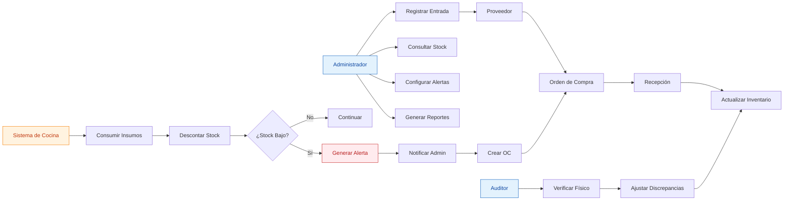
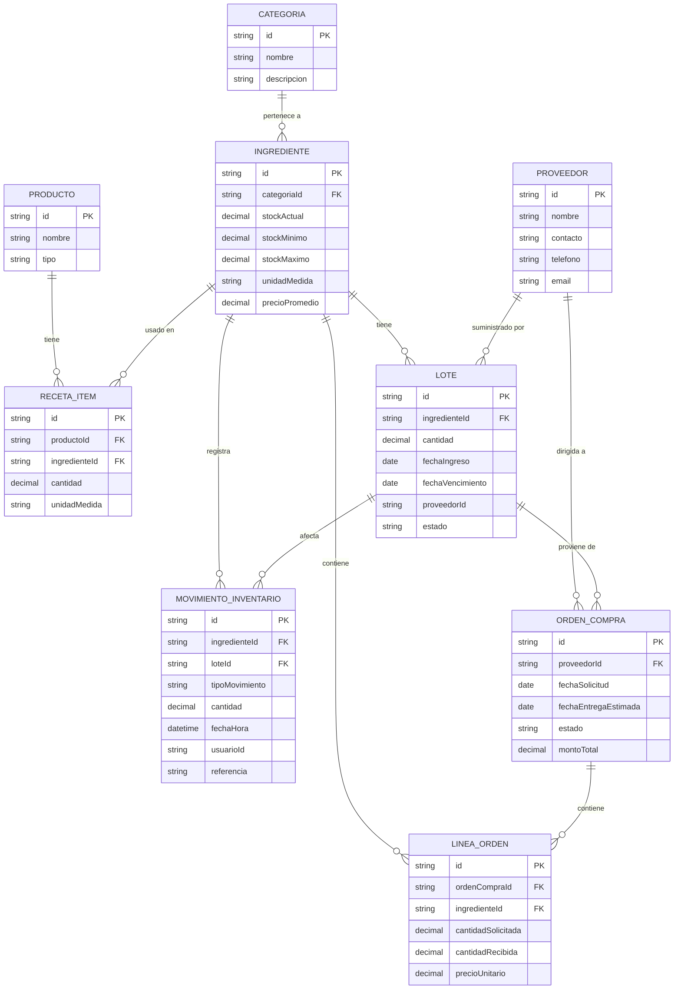
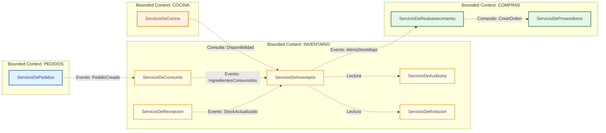
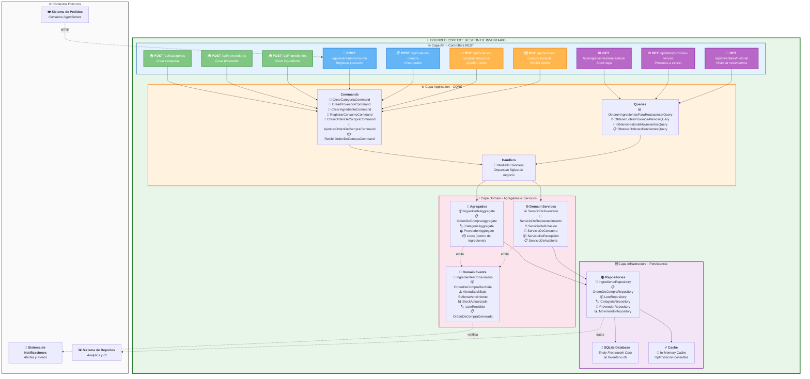
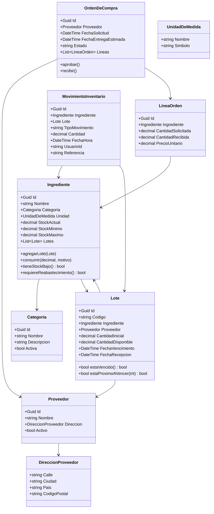

# 📚 Documentación DDD - Sistema de Inventario de Restaurante

## 0. Flujo Organizacional - Gestión de Inventarios




## 📋 Tabla de Contenidos

1. [Estructura Organizacional y Dominios](#1-estructura-organizacional-y-dominios)
2. [Dominio Seleccionado: Gestión de Inventario](#2-dominio-seleccionado-gestión-de-inventario)
3. [Entidades y Agregados](#3-entidades-y-agregados)
4. [Bounded Context](#4-bounded-context)
5. [Lenguaje Ubicuo - Glosario](#5-lenguaje-ubicuo---glosario)
6. [Objetos de Valor](#6-objetos-de-valor)
7. [Triggers y Eventos del Dominio](#7-triggers-y-eventos-del-dominio)
8. [Servicios del Dominio](#8-servicios-del-dominio)

---

## 1. Estructura Organizacional y Dominios


---

### 1.1 Diagrama Entidad-Relación (ERD)




### Dominios Identificados por Afinidad:

1. **🍽️ Gestión de Operaciones** - Core Domain para servicio al cliente
2. **📦 Gestión de Inventario** - **DOMINIO SELECCIONADO** (Supporting Domain crítico)
3. **👥 Recursos Humanos** - Supporting Domain

### 1.2 Bounded Contexts y Servicios de Dominio



- **Invariantes**:
  - Cantidad disponible no puede exceder cantidad inicial
  - Fecha de vencimiento debe ser futura al momento de recepción
  - Código de lote debe ser único

---

## 4. Bounded Context



### Flujo de Interacciones:

1. **API REST Controllers** → Recibe requests HTTP (IngredientesController, OrdenesCompraController, etc.)
2. **Commands & Queries** → Encapsula intención del usuario (CQRS)
3. **Handlers (MediatR)** → Orquesta lógica de aplicación
4. **Agregados** → Aplica reglas de negocio (IngredienteAggregate, OrdenDeCompraAggregate)
5. **Servicios de Dominio** → Coordina operaciones complejas (ServicioDeInventario, ServicioDeReabastecimiento)
6. **Repositorios** → Persiste en base de datos (SQLite con Entity Framework Core)
7. **Domain Events** → Notifica cambios importantes (IngredientesConsumidos, AlertaStockBajo, etc.)
8. **Event Handlers** → Reacciona a eventos del dominio

---

## 5. Lenguaje Ubicuo - Glosario

### 📖 Términos de Negocio del Dominio de Inventario

| Término                      | Definición                                                                                                        | Sinónimos                           |
| ---------------------------- | ----------------------------------------------------------------------------------------------------------------- | ----------------------------------- |
| **Ingrediente**              | Materia prima o insumo utilizado en la preparación de platos del restaurante                                      | Insumo, Producto, Material          |
| **Lote**                     | Conjunto de unidades de un ingrediente recibidas en una misma fecha con el mismo proveedor y fecha de vencimiento | Batch, Remesa                       |
| **Stock**                    | Cantidad disponible de un ingrediente en el inventario                                                            | Existencias, Disponibilidad         |
| **Stock Mínimo**             | Cantidad mínima que debe mantenerse de un ingrediente para evitar desabastecimiento                               | Nivel de Reorden, Punto de Pedido   |
| **Stock Máximo**             | Cantidad máxima que se puede almacenar de un ingrediente                                                          | Capacidad Máxima                    |
| **Orden de Compra**          | Documento que solicita la compra de ingredientes a un proveedor                                                   | OC, Purchase Order                  |
| **Movimiento de Inventario** | Registro de entrada o salida de ingredientes del almacén                                                          | Transacción, Operación              |
| **Consumo**                  | Uso de ingredientes para preparar platos (salida de inventario)                                                   | Uso, Utilización                    |
| **Recepción**                | Entrada de mercancía al inventario proveniente de un proveedor                                                    | Ingreso, Entrada                    |
| **FEFO**                     | First Expired, First Out - Método de rotación que prioriza el uso de lotes próximos a vencer                      | Primero en Vencer, Primero en Salir |
| **Merma**                    | Pérdida de ingredientes por deterioro, vencimiento o daño                                                         | Desperdicio, Loss                   |
| **Reabastecer**              | Acción de solicitar más stock de un ingrediente cuando alcanza el nivel mínimo                                    | Reorden, Reponer                    |
| **Proveedor**                | Empresa o persona que suministra ingredientes al restaurante                                                      | Supplier, Vendor                    |
| **Unidad de Medida**         | Forma en que se cuantifica un ingrediente (kg, litros, unidades, etc.)                                            | UM, UoM                             |
| **Categoría**                | Clasificación de ingredientes (carnes, vegetales, lácteos, etc.)                                                  | Tipo, Clase                         |
| **Vencimiento**              | Fecha límite en que un lote puede ser utilizado de forma segura                                                   | Caducidad, Fecha de Expiración      |
| **Aprobar Orden**            | Autorización para proceder con una orden de compra                                                                | Autorizar, Validar                  |
| **Estado de Orden**          | Situación actual de una orden de compra (Pendiente, Aprobada, Recibida, Cancelada)                                | Status                              |

### 🗣️ Frases del Lenguaje Ubicuo:

- "Necesitamos **reabastecer** el tomate porque está por debajo del **stock mínimo**"
- "El **lote** de pollo venció ayer, hay que registrar una **merma**"
- "Aprobé la **orden de compra** #OC-001 del **proveedor** Carnes del Valle"
- "Registra el **consumo** de 5 kg de papa para el plato del día"
- "Aplicamos **FEFO** para usar primero los lotes próximos a **vencer**"
- "Recibimos el **lote** LOT-2024-001 con 50 unidades de la **orden de compra** #OC-002"

---

## 6. Objetos de Valor

### 💎 Value Objects del Dominio


### 1.3 Modelo de Dominio (UML simplificado)



#### 🔹 **UnidadDeMedida**

```csharp
public class UnidadDeMedida : ValueObject
{
    public string Nombre { get; }
    public string Simbolo { get; }

    // Ejemplos:
    // - Kilogramo (kg)
    // - Litro (L)
    // - Unidad (un)
    // - Gramo (g)
}
```

**Características**:

- Inmutable
- Igualdad por valor (dos unidades con mismo nombre y símbolo son iguales)
- Sin identidad propia

#### 🔹 **Cantidad**

```csharp
public class Cantidad : ValueObject
{
    public decimal Valor { get; }
    public UnidadDeMedida UnidadMedida { get; }

    public Cantidad Sumar(Cantidad otra)
    public Cantidad Restar(Cantidad otra)
    public bool EsMayorQue(Cantidad otra)
}
```

**Reglas**:

- No se pueden sumar cantidades con diferentes unidades de medida
- El valor debe ser siempre >= 0
- Operaciones retornan nuevas instancias (inmutabilidad)

#### 🔹 **DireccionProveedor** ✅

```csharp
public class DireccionProveedor : ValueObject
{
    public string Calle { get; }
    public string Ciudad { get; }
    public string Pais { get; }
    public string CodigoPostal { get; }
}
```

**Uso**: Dirección de proveedores para entregas  
**Ubicación**: `InventarioDDD.Domain.ValueObjects.DireccionProveedor`

#### 🔹 **PrecioConMoneda** ✅

```csharp
public class PrecioConMoneda : ValueObject
{
    public decimal Monto { get; }
    public string Moneda { get; } // "COP", "USD", etc.

    public PrecioConMoneda Multiplicar(decimal factor)
    public PrecioConMoneda Sumar(PrecioConMoneda otro)
}
```

**Uso**: Precios unitarios en órdenes de compra y lotes  
**Ubicación**: `InventarioDDD.Domain.ValueObjects.PrecioConMoneda`

#### 🔹 **FechaVencimiento** ✅

```csharp
public class FechaVencimiento : ValueObject
{
    public DateTime Valor { get; }

    public bool EstaVencido()
    public int DiasHastaVencimiento()
    public bool EsProximoAVencer(int dias = 7)
}
```

**Uso**: Fechas de vencimiento de lotes  
**Ubicación**: `InventarioDDD.Domain.ValueObjects.FechaVencimiento`

#### 🔹 **RangoDeStock** ✅

```csharp
public class RangoDeStock : ValueObject
{
    public decimal StockMinimo { get; }
    public decimal StockMaximo { get; }

    public bool EstaEnRango(decimal cantidad)
    public bool EstaBajo(decimal cantidad)
    public decimal CalcularPuntoDeReorden()
}
```

**Uso**: Rangos de stock mínimo y máximo de ingredientes  
**Ubicación**: `InventarioDDD.Domain.ValueObjects.RangoDeStock`

---

## 7. Triggers y Eventos del Dominio

```mermaid
sequenceDiagram
    autonumber
    participant 👤 as Usuario
    participant 🌐 as API Controller
    participant 📝 as Command Handler
    participant 🧱 as Aggregate
    participant 📚 as Repository
    participant 💾 as Database
    participant 🔔 as Event Bus
    participant 📢 as NotificationService

    rect rgb(255, 245, 230)
        Note over 👤,📢: 🔄 FLUJO 1: Registro de Consumo de Ingrediente
        
        👤->>🌐: POST /api/inventario/consumo<br/>{ingredienteId, cantidad, loteId}
        activate 🌐
        🌐->>📝: Send(RegistrarConsumoCommand)
        activate 📝
        
        📝->>📚: ObtenerPorId(ingredienteId)
        activate 📚
        📚->>💾: SELECT * FROM Ingredientes
        💾-->>📚: Ingrediente
        📚-->>📝: IngredienteAggregate
        deactivate 📚
        
        📝->>🧱: RegistrarConsumo(cantidad, loteId)
        activate 🧱
        
        🧱->>🧱: ✅ Validar stock suficiente
        🧱->>🧱: 📉 Reducir CantidadEnStock
        
        alt Stock < StockMinimo
            🧱->>🔔: � Publish(StockBajoDetectadoEvent)
            activate 🔔
            🔔->>📢: ⚠️ Enviar alerta
            activate 📢
            📢-->>👤: 📧 Email: "Reabastecer Tomate"
            deactivate 📢
            deactivate 🔔
        end
        
        🧱->>🔔: Publish(IngredienteConsumidoEvent)
        deactivate 🧱
        
        📝->>📚: Actualizar(ingrediente)
        📚->>💾: UPDATE Ingredientes
        
        📝-->>🌐: Success
        deactivate 📝
        🌐-->>👤: ✅ 200 OK - Consumo registrado
        deactivate 🌐
    end

    rect rgb(230, 245, 255)
        Note over 👤,📢: 🔄 FLUJO 2: Creación y Aprobación de Orden de Compra
        
        👤->>🌐: POST /api/ordenes-compra<br/>{ingredienteId, proveedorId, cantidad}
        activate 🌐
        🌐->>📝: Send(CrearOrdenCommand)
        activate 📝
        
        📝->>🧱: CrearOrden(params)
        activate 🧱
        🧱->>🧱: Estado = Pendiente
        🧱->>🧱: GenerarNumero()
        🧱->>🔔: Publish(OrdenCreadaEvent)
        deactivate 🧱
        
        📝->>📚: Agregar(orden)
        📚->>�: INSERT INTO OrdenesCompra
        
        📝-->>🌐: OrdenId
        deactivate 📝
        🌐-->>👤: ✅ 201 Created - OC-001
        deactivate 🌐
        
        Note over 👤: ⏳ Tiempo después...
        
        👤->>🌐: PUT /api/ordenes-compra/OC-001/aprobar
        activate 🌐
        🌐->>📝: Send(AprobarOrdenCommand)
        activate 📝
        
        📝->>📚: ObtenerPorId(ordenId)
        📚-->>📝: OrdenAggregate
        
        📝->>🧱: Aprobar()
        activate 🧱
        🧱->>🧱: ✅ Validar estado = Pendiente
        🧱->>🧱: 🔄 Estado = Aprobada
        🧱->>🔔: Publish(OrdenDeCompraAprobada)
        activate 🔔
        🔔->>📢: 📧 Notificar proveedor
        activate 📢
        📢-->>👤: 📩 Email confirmación
        deactivate 📢
        deactivate 🔔
        deactivate 🧱
        
        📝->>📚: Actualizar(orden)
        📚->>💾: UPDATE OrdenesCompra
        
        📝-->>🌐: Success
        deactivate 📝
        🌐-->>👤: ✅ 200 OK - Orden aprobada
        deactivate 🌐
    end

    rect rgb(245, 255, 230)
        Note over 👤,📢: 🔄 FLUJO 3: Recepción de Mercancía y Creación de Lote
        
        👤->>🌐: PUT /api/ordenes-compra/OC-001/recibir<br/>{cantidadRecibida, fechaVencimiento}
        activate 🌐
        🌐->>📝: Send(RecibirOrdenCommand)
        activate 📝
        
        📝->>📚: ObtenerPorId(ordenId)
        📚-->>📝: OrdenAggregate
        
        📝->>🧱: Recibir(cantidad, fechaVenc)
        activate 🧱
        🧱->>🧱: ✅ Validar estado = Aprobada
        🧱->>🧱: 🔄 Estado = Recibida
        🧱->>🔔: Publish(OrdenDeCompraRecibida)
        activate 🔔
        deactivate 🧱
        
        🔔->>📝: EventHandler: Crear Lote
        activate 📝
        📝->>🧱: CrearLote(ordenData)
        activate 🧱
        🧱->>🧱: 🏷️ Generar código único
        🧱->>🧱: 📦 CantidadInicial = cantidad
        🧱->>🧱: ⏰ FechaVencimiento
        🧱->>🔔: Publish(LoteRecibido)
        deactivate 🧱
        deactivate 📝
        deactivate 🔔
        
        Note over 📝: 🔄 Actualizar stock ingrediente
        📝->>📚: ObtenerIngrediente(ingredienteId)
        📚-->>📝: Ingrediente
        📝->>🧱: ActualizarStock(+cantidad)
        activate 🧱
        🧱->>🧱: 📈 Stock += cantidad
        🧱->>🔔: Publish(StockActualizado)
        deactivate 🧱
        
        📝->>📚: Actualizar(orden, lote, ingrediente)
        📚->>💾: BEGIN TRANSACTION<br/>UPDATE OrdenesCompra<br/>INSERT Lotes<br/>UPDATE Ingredientes<br/>COMMIT
        
        📝-->>🌐: Success
        deactivate 📝
        🌐-->>👤: ✅ 200 OK - Mercancía recibida
        deactivate 🌐
    end

    rect rgb(255, 230, 245)
        Note over 👤,📢: 🔄 FLUJO 4: Alerta Automática de Vencimiento (Job Programado)
        
        Note over 📝: ⏰ Job ejecuta diariamente a las 00:00
        activate 📝
        📝->>📚: ObtenerLotesActivosConFechaVencimiento()
        activate 📚
        📚->>💾: SELECT * FROM Lotes<br/>WHERE CantidadDisponible > 0<br/>AND FechaVencimiento <= TODAY + 7
        💾-->>📚: List<Lote>
        📚-->>📝: Lotes próximos a vencer
        deactivate 📚
        
        loop Por cada lote próximo a vencer
            📝->>🧱: ValidarVencimiento(lote)
            activate 🧱
            
            alt Vence en < 7 días
                🧱->>🧱: 📊 CalcularDiasRestantes()
                🧱->>🔔: � Publish(LoteProximoVencerEvent)
                activate 🔔
                🔔->>📢: ⚠️ Enviar alerta urgente
                activate 📢
                
                alt Vence en < 3 días
                    📢-->>👤: 🔴 Alerta CRÍTICA<br/>"Lote LOT-001 vence en 2 días"
                else Vence en < 7 días
                    📢-->>👤: 🟡 Alerta ADVERTENCIA<br/>"Lote LOT-002 vence en 5 días"
                end
                
                deactivate 📢
                deactivate 🔔
            end
            
            deactivate 🧱
        end
        
        deactivate 📝
        Note over 📝: ✅ Job finalizado
    end
```



### 🎯 Eventos del Dominio (Implementados)

#### 🔔 **1. IngredientesConsumidos** ✅

```csharp
public class IngredientesConsumidos : DomainEvent
{
    public Guid IngredienteId { get; private set; }
    public decimal CantidadConsumida { get; private set; }
    public UnidadDeMedida UnidadDeMedida { get; private set; }
    public string Motivo { get; private set; }
    public List<ConsumoLote> LotesConsumidos { get; private set; }
    public Guid? UsuarioId { get; private set; }
}
```

**Trigger**: Al registrar consumo de un ingrediente  
**Ubicación**: `InventarioDDD.Domain.Events.InventarioEvents`

---

#### 🔔 **2. AlertaStockBajo** ✅

```csharp
public class AlertaStockBajo : DomainEvent
{
    public Guid IngredienteId { get; private set; }
    public string NombreIngrediente { get; private set; }
    public decimal StockActual { get; private set; }
    public decimal StockMinimo { get; private set; }
    public UnidadDeMedida UnidadDeMedida { get; private set; }
    public int NivelUrgencia { get; private set; } // 1: Bajo, 2: Crítico, 3: Agotado
}
```

**Trigger**: Cuando stock < stock mínimo después de un consumo  
**Ubicación**: `InventarioDDD.Domain.Events.InventarioEvents`

---

#### 🔔 **3. OrdenDeCompraGenerada** ✅

```csharp
public class OrdenDeCompraGenerada : DomainEvent
{
    public Guid OrdenId { get; }
    public string NumeroOrden { get; }
    public Guid ProveedorId { get; }
    public Guid IngredienteId { get; }
    public decimal CantidadSolicitada { get; }
    public DateTime FechaCreacion { get; }
}
```

**Trigger**: Al crear una nueva orden de compra  
**Suscriptores**:

- AuditoriaService (registra la operación)

---

#### 🔔 **4. OrdenDeCompraAprobadaEvent**

```csharp
public class OrdenDeCompraAprobadaEvent : IDomainEvent
{
    public Guid OrdenId { get; }
    public string NumeroOrden { get; }
    public Guid ProveedorId { get; }
    public string NombreProveedor { get; }
    public DateTime FechaAprobacion { get; }
    public string UsuarioQueAprobo { get; }
}
```

**Trigger**: Al aprobar una orden de compra  
**Suscriptores**:

- EmailService (notifica al proveedor)
- WorkflowService (marca tarea como completada)

---

#### 🔔 **5. OrdenDeCompraRecibidaEvent**

```csharp
public class OrdenDeCompraRecibidaEvent : IDomainEvent
{
    public Guid OrdenId { get; }
    public string NumeroOrden { get; }
    public Guid IngredienteId { get; }
    public decimal CantidadRecibida { get; }
    public DateTime FechaRecepcion { get; }
    public DateTime FechaVencimiento { get; }
    public string CodigoLoteGenerado { get; }
}
```

**Trigger**: Al recibir mercancía de una orden aprobada  
**Suscriptores**:

- LoteService (crea nuevo lote)
- InventarioService (actualiza stock del ingrediente)
- FinanzasService (registra pasivo con proveedor)

---

#### 🔔 **6. LoteCreadoEvent**

```csharp
public class LoteCreadoEvent : IDomainEvent
{
    public Guid LoteId { get; }
    public string Codigo { get; }
    public Guid IngredienteId { get; }
    public decimal Cantidad { get; }
    public DateTime FechaVencimiento { get; }
    public Guid? OrdenDeCompraId { get; }
}
```

**Trigger**: Al crear un nuevo lote (recepción de mercancía)  
**Suscriptores**:

- VencimientoService (programa alerta de vencimiento)
- TrazabilidadService (registra cadena de custodia)

---

#### 🔔 **7. LoteProximoAVencerEvent**

```csharp
public class LoteProximoAVencerEvent : IDomainEvent
{
    public Guid LoteId { get; }
    public string Codigo { get; }
    public Guid IngredienteId { get; }
    public string NombreIngrediente { get; }
    public DateTime FechaVencimiento { get; }
    public int DiasHastaVencimiento { get; }
    public decimal CantidadDisponible { get; }
}
```

**Trigger**: Job automático diario que detecta lotes que vencen en < 7 días  
**Suscriptores**:

- NotificacionesService (alerta urgente al chef)
- SugerenciasMenuService (sugiere usar ese ingrediente en menú del día)

---

#### 🔔 **8. StockActualizadoEvent**

```csharp
public class StockActualizadoEvent : IDomainEvent
{
    public Guid IngredienteId { get; }
    public decimal StockAnterior { get; }
    public decimal StockNuevo { get; }
    public string TipoMovimiento { get; } // "Entrada" o "Salida"
    public DateTime FechaActualizacion { get; }
}
```

**Trigger**: Cada vez que cambia el stock de un ingrediente  
**Suscriptores**:

- DashboardService (actualiza métricas en tiempo real)
- CacheService (invalida cache de stock)

---

## 8. Servicios del Dominio

### ⚙️ Domain Services (Implementados)

```mermaid
graph TB
    subgraph SERVICES["⚙️ DOMAIN SERVICES"]
        
        subgraph SVC1["📊 ServicioDeInventario"]
            INV1["<b>ConsultarStockDisponible</b><br/>📦 Obtiene stock de un ingrediente<br/>🔢 Retorna CantidadDisponible"]
            INV2["<b>VerificarDisponibilidadParaPedido</b><br/>✅ Valida disponibilidad para pedido<br/>📋 Verifica múltiples ingredientes"]
            INV3["<b>CalcularValoracionInventario</b><br/>💵 Calcula valor monetario total<br/>📈 Suma precio × cantidad todos los lotes"]
            INV4["<b>CalcularCantidadOptima</b><br/>📊 Basado en consumo histórico<br/>🎯 StockMax - StockActual + Buffer"]
            INV5["<b>RequiereReabastecimientoUrgente</b><br/>⚠️ Evalúa urgencia de reabastecimiento<br/>📅 < 3 días de stock = urgente"]
            INV6["<b>ValidarRecepcionLote</b><br/>✅ Valida reglas de negocio<br/>🔍 Verifica fechas, códigos únicos"]
            INV7["<b>ObtenerLotesPrioritarios</b><br/>� Implementa FEFO<br/>📦 Prioriza lotes más antiguos"]
            INV8["<b>CalcularMetricasRotacion</b><br/>📊 Análisis de rotación<br/>📈 Índice, velocidad, días stock"]
        end

        subgraph SVC2["� ServicioDeReabastecimiento"]
            REA1["<b>GenerarOrdenDeCompraAutomatica</b><br/>🤖 Crea órdenes automáticas<br/>� Agrupa por proveedor"]
            REA2["<b>CalcularPuntoDeReorden</b><br/>📊 ConsumoPromedio × LeadTime<br/>⚠️ + Stock de seguridad (50%)"]
            REA3["<b>SugerirProveedor</b><br/>🏢 Selecciona mejor proveedor<br/>⭐ Basado en desempeño histórico"]
            REA4["<b>IdentificarIngredientesParaReabastecimiento</b><br/>⚠️ Detecta stock < punto reorden<br/>📋 Genera alertas priorizadas"]
        end

        subgraph SVC3["⏰ ServicioDeRotacion"]
            ROT1["<b>CalcularRotacionIngrediente</b><br/>� Análisis completo de rotación<br/>📈 Índice, velocidad, tendencias"]
            ROT2["<b>IdentificarIngredientesLentaRotacion</b><br/>🐌 Detecta rotación lenta<br/>💰 Calcula capital inmovilizado"]
            ROT3["<b>ProyectarDemanda</b><br/>� Proyección basada en histórico<br/>📊 Escenarios optimista/pesimista"]
            ROT4["<b>GenerarReporteRotacionGeneral</b><br/>� Reporte completo todos ingredientes<br/>� Clasificación por velocidad"]
            ROT5["<b>CalcularIndiceRotacion</b><br/>� Consumo / Stock Promedio<br/>� Clasifica: Rápida/Media/Lenta"]
            ROT6["<b>CalcularDiasCobertura</b><br/>📅 Stock actual / Consumo diario<br/>⏰ Cuántos días durará el stock"]
        end

        subgraph SVC4["� ServicioDeConsumo"]
            CON1["<b>RegistrarConsumo</b><br/>📝 Procesa consumo de ingredientes<br/>🔄 Aplica FEFO automáticamente"]
            CON2["<b>ValidarDisponibilidad</b><br/>✅ Verifica stock suficiente<br/>� Consulta lotes disponibles"]
            CON3["<b>SeleccionarLotesParaConsumo</b><br/>🎯 Aplica estrategia FEFO<br/>� Prioriza próximos a vencer"]
        end

        subgraph SVC5["� ServicioDeRecepcion"]
            REC1["<b>ProcesarRecepcionOrden</b><br/>� Recibe mercancía<br/>🏷️ Crea lotes automáticamente"]
            REC2["<b>ValidarCalidadRecepcion</b><br/>✅ Verifica condiciones<br/>📋 Detecta discrepancias"]
            REC3["<b>ActualizarStockAlRecibir</b><br/>📈 Incrementa stock ingrediente<br/>💾 Registra movimiento entrada"]
        end

        subgraph SVC6["📋 ServicioDeAuditoria"]
            AUD1["<b>RegistrarEvento</b><br/>📝 Auditoría de operaciones<br/>� Timestamp + usuario"]
            AUD2["<b>ObtenerHistorialAuditoria</b><br/>📊 Consulta histórico<br/>🔍 Filtros múltiples"]
        end
    end

    subgraph REPO["📚 REPOSITORIES"]
        R1["🥗 IngredienteRepository"]
        R2["📋 OrdenDeCompraRepository"]
        R3["📦 LoteRepository"]
        R4["📊 MovimientoRepository"]
        R5["🏢 ProveedorRepository"]
    end

    subgraph DB["💾 DATABASE"]
        DBX["SQLite Database<br/>📊 Inventario.db"]
    end

    INV1 & INV2 & INV3 & INV4 --> R1
    INV1 & INV3 & INV4 --> R3
    
    OC1 & OC2 & OC3 & OC4 --> R2
    OC2 --> R5
    OC4 --> R1
    
    VEN1 & VEN2 & VEN3 & VEN4 --> R3
    VEN3 --> R4
    
    MOV1 & MOV2 & MOV3 --> R4
    
    REA1 & REA2 & REA3 --> R1
    REA3 --> R2
    
    R1 & R2 & R3 & R4 & R5 --> DBX

    style SERVICES fill:#E8F5E9,stroke:#2E7D32,stroke-width:3px
    style SVC1 fill:#FFF3E0,stroke:#F57C00,stroke-width:2px
    style SVC2 fill:#E3F2FD,stroke:#1565C0,stroke-width:2px
    style SVC3 fill:#FCE4EC,stroke:#C2185B,stroke-width:2px
    style SVC4 fill:#F3E5F5,stroke:#7B1FA2,stroke-width:2px
    style SVC5 fill:#E0F2F1,stroke:#00695C,stroke-width:2px
    style REPO fill:#FAFAFA,stroke:#616161,stroke-width:2px
    style DB fill:#263238,stroke:#000,stroke-width:2px,color:#fff
    
    style INV1 fill:#FFE0B2,stroke:#E65100,stroke-width:2px
    style INV2 fill:#FFE0B2,stroke:#E65100,stroke-width:2px
    style INV3 fill:#FFE0B2,stroke:#E65100,stroke-width:2px
    style INV4 fill:#FFE0B2,stroke:#E65100,stroke-width:2px
    
    style OC1 fill:#BBDEFB,stroke:#0D47A1,stroke-width:2px
    style OC2 fill:#BBDEFB,stroke:#0D47A1,stroke-width:2px
    style OC3 fill:#BBDEFB,stroke:#0D47A1,stroke-width:2px
    style OC4 fill:#BBDEFB,stroke:#0D47A1,stroke-width:2px
    
    style VEN1 fill:#F8BBD0,stroke:#880E4F,stroke-width:2px
    style VEN2 fill:#F8BBD0,stroke:#880E4F,stroke-width:2px
    style VEN3 fill:#F8BBD0,stroke:#880E4F,stroke-width:2px
    style VEN4 fill:#F8BBD0,stroke:#880E4F,stroke-width:2px
    
    style MOV1 fill:#E1BEE7,stroke:#4A148C,stroke-width:2px
    style MOV2 fill:#E1BEE7,stroke:#4A148C,stroke-width:2px
    style MOV3 fill:#E1BEE7,stroke:#4A148C,stroke-width:2px
    
    style REA1 fill:#B2DFDB,stroke:#004D40,stroke-width:2px
    style REA2 fill:#B2DFDB,stroke:#004D40,stroke-width:2px
    style REA3 fill:#B2DFDB,stroke:#004D40,stroke-width:2px
```



---

### 🔧 **1. ServicioDeInventario** ✅

**Responsabilidad**: Coordinar operaciones de inventario que involucran múltiples agregados.  
**Ubicación**: `InventarioDDD.Domain.Services.ServicioDeInventario`

**Métodos Principales**:
- `ConsultarStockDisponible(Guid ingredienteId)` - Consulta stock disponible
- `VerificarDisponibilidadParaPedido(Guid pedidoId, List<RequisitoIngrediente>)` - Valida disponibilidad
- `CalcularValoracionInventario()` - Calcula valor monetario total
- `CalcularCantidadOptima(IngredienteAggregate, historial, diasProyeccion)` - Cantidad óptima a ordenar
- `RequiereReabastecimientoUrgente(IngredienteAggregate, historial)` - Evalúa urgencia
- `ValidarRecepcionLote(Lote, IngredienteAggregate)` - Valida reglas de negocio
- `ObtenerLotesPrioritarios(IngredienteAggregate)` - Implementa FEFO
- `CalcularMetricasRotacion(IngredienteAggregate, movimientos, fechas)` - Análisis de rotación

**Casos de Uso**:
- Dashboard: Mostrar valor total del inventario
- Reportes: Análisis de stock y métricas
- Alertas: Detectar ingredientes para reabastecer
- Validaciones: Reglas de negocio para recepciones

---

### 🔧 **2. ServicioDeReabastecimiento** ✅

**Responsabilidad**: Lógica para sugerir y automatizar reabastecimientos.  
**Ubicación**: `InventarioDDD.Domain.Services.ServicioDeReabastecimiento`

**Métodos Principales**:
- `GenerarOrdenDeCompraAutomatica()` - Crea órdenes automáticas agrupadas por proveedor
- `CalcularPuntoDeReorden(Guid ingredienteId)` - Calcula punto de reorden basado en histórico
- `SugerirProveedor(Guid ingredienteId)` - Selecciona mejor proveedor según desempeño
- `IdentificarIngredientesParaReabastecimiento()` - Genera lista de alertas priorizadas

**Fórmulas Implementadas**:
- Punto de Reorden = `ConsumoPromedioDiario × LeadTime(7 días) + StockSeguridad(50%)`
- Cantidad Sugerida = `StockMaximo - StockActual + StockSeguridad`

**Casos de Uso**:
- Job automático diario para crear órdenes
- Sugerencias inteligentes de cantidad
- Selección óptima de proveedores
- Optimización de inventario

---

### 🔧 **3. ServicioDeRotacion** ✅

**Responsabilidad**: Análisis de rotación de inventario y proyección de demanda.  
**Ubicación**: `InventarioDDD.Domain.Services.ServicioDeRotacion`

**Métodos Principales**:
- `CalcularRotacionIngrediente(Guid, PeriodoAnalisis)` - Análisis completo de rotación
- `IdentificarIngredientesLentaRotacion(umbral, dias)` - Detecta rotación lenta
- `ProyectarDemanda(Guid, diasProyeccion)` - Proyección con escenarios
- `GenerarReporteRotacionGeneral(PeriodoAnalisis)` - Reporte completo

**Métricas Calculadas**:
- **Índice de Rotación** = `TotalConsumido / StockPromedio`
- **Velocidad de Rotación** = `Días / ÍndiceRotación`
- **Días de Cobertura** = `StockActual / ConsumoPromedioDiario`

**Clasificación**:
- Muy Rápida: >= 6
- Rápida: >= 4
- Media: >= 2
- Lenta: >= 1
- Muy Lenta: < 1

**Casos de Uso**:
- Alertas de lotes próximos a vencer
- Aplicar FEFO al registrar consumos
- Reportes de mermas y rotación
- Proyección de demanda futura
- Identificación de capital inmovilizado

---

### 🔧 **4. ServicioDeConsumo** ✅

**Responsabilidad**: Procesar consumos con aplicación automática de FEFO.  
**Ubicación**: `InventarioDDD.Domain.Services.ServicioDeConsumo`

**Métodos Principales**:
- `RegistrarConsumo()` - Procesa consumo aplicando FEFO
- `ValidarDisponibilidad()` - Verifica stock suficiente
- `SeleccionarLotesParaConsumo()` - Aplica estrategia FEFO automáticamente

**Casos de Uso**:
- Registro de consumos desde cocina
- Aplicación automática de FEFO
- Validación de disponibilidad antes de preparar pedidos

---

### 🔧 **5. ServicioDeRecepcion** ✅

**Responsabilidad**: Procesar recepciones de mercancía.  
**Ubicación**: `InventarioDDD.Domain.Services.ServicioDeRecepcion`

**Métodos Principales**:
- `ProcesarRecepcionOrden()` - Recibe mercancía y crea lotes
- `ValidarCalidadRecepcion()` - Verifica condiciones y detecta discrepancias
- `ActualizarStockAlRecibir()` - Incrementa stock y registra movimiento

**Casos de Uso**:
- Recepción de órdenes de compra
- Creación automática de lotes
- Detección de discrepancias
- Actualización de stock

---

### 🔧 **6. ServicioDeAuditoria** ✅

**Responsabilidad**: Auditoría de operaciones del sistema.  
**Ubicación**: `InventarioDDD.Domain.Services.ServicioDeAuditoria`

**Métodos Principales**:
- `RegistrarEvento()` - Auditoría de operaciones
- `ObtenerHistorialAuditoria()` - Consulta histórico con filtros

**Casos de Uso**:
- Trazabilidad de operaciones
- Auditoría de cambios
- Reportes de actividad

---

## 📊 Resumen de Arquitectura

### Capas del Sistema:

1. **🌐 API Layer** (InventarioDDD.API)

   - Controllers REST
   - Middleware de excepciones
   - Swagger/OpenAPI

2. **📋 Application Layer** (InventarioDDD.Application)

   - Commands y Queries (CQRS)
   - Handlers
   - DTOs

3. **🎯 Domain Layer** (InventarioDDD.Domain)

   - Agregados
   - Entidades
   - Value Objects
   - Domain Services
   - Domain Events
   - Interfaces de Repositorios

4. **🗄️ Infrastructure Layer** (InventarioDDD.Infrastructure)
   - Repositorios (Entity Framework Core)
   - Configuraciones de EF
   - Persistencia (SQLite)
   - Cache

---

## 🚀 Tecnologías Utilizadas

- **.NET 9.0** - Framework backend
- **Entity Framework Core 9.0.9** - ORM
- **SQLite** - Base de datos
- **MediatR** - Patrón Mediator para CQRS
- **React 18.2** + **TypeScript 4.9** - Frontend
- **React Router 6.26** - Enrutamiento SPA

---

## 📝 Notas de Implementación

### Decisiones de Diseño:

✅ **Agregados pequeños**: Cada agregado tiene responsabilidad única  
✅ **Inmutabilidad en Value Objects**: Garantiza consistencia  
✅ **CQRS**: Separación de comandos y consultas  
✅ **Domain Events**: Comunicación desacoplada entre bounded contexts  
✅ **Repository Pattern**: Abstracción de persistencia  
✅ **FEFO**: Estrategia de rotación para minimizar vencimientos

### Invariantes Críticas:

🔒 Stock nunca puede ser negativo  
🔒 Solo órdenes aprobadas pueden ser recibidas  
🔒 Cantidad disponible de lote ≤ cantidad inicial  
🔒 Fecha de vencimiento debe ser futura al crear lote  
🔒 Stock mínimo < stock máximo

---

## 📖 Referencias

- **Domain-Driven Design** - Eric Evans
- **Implementing Domain-Driven Design** - Vaughn Vernon
- **Clean Architecture** - Robert C. Martin
- **CQRS Pattern** - Martin Fowler

---

**Última actualización**: Octubre 2025  
**Versión del sistema**: 1.0  
**Bounded Context**: Gestión de Inventario
